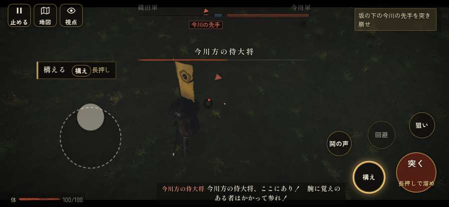

# テストプレイヤーの感想：はじめての中学生

- 人：ハルト（13歳・中学一年）（4505番）
- 変わり目：台詞を全部読む・iPhone 横 932×430・新しく始める通し・ふつう・足軽から・問屋:馬・三人称・感度 ふつう・途中で止める
- 時：2026/10/3 11:55:44（109秒かかった）
- 画面：iPhone の横向き 932×430・倍率3・指で触る操作（touch.js の釦・棒・なぞり）・画質 低
- 遊んだ戦：桶狭間の戦い（達成）
- 機械の混み具合：3（load average）

## ひとこと

> 友だちにすすめられて、やってみた。桶狭間をやった。1回はなんかクリアできた。「「狙い」をしたいのに、押す丸が出ていない」のとこ、だるい。「城下から出陣できなかった」のとこ、ふつうに困った。「行き先があるのに20秒動かない兵」のとこ、だるい。ぶっちゃけ、ここで一回やめかけた。問屋で「駄馬8貫」買ってみた。

## 見つけた問題（5件・困った順）

### 1. 字が小さい（11px 未満）
- どこで：森部の戦いの前・問屋
- 何が：g > g > text：5.6px「問」／g > g > text：5.6px「屋」
- どれくらい困ったか：★★★ やめたくなった（3回）
- 直し方の目安：11px 以上にする（飾りの字なら外す）
- 画面：（その戦の山場の一枚）

### 2. 城下から出陣できなかった
- どこで：森部の戦いの前・城下
- 何が：「出陣」の釦が見つからない・押しても戦の前の札が出ない
- どれくらい困ったか：★★★ やめたくなった（1回）
- 画面：（その戦の山場の一枚）

### 3. HUD の札どうしが重なって読めない
- どこで：桶狭間の戦い・5秒・march
- 何が：#armybar と #bark（932×430）
- どれくらい困ったか：★★ かなり困った（2回）
- 直し方の目安：置き場所をずらすか、片方を出している間はもう片方を隠す
- 画面：（その戦の山場の一枚）

### 4. 行き先があるのに20秒動かない兵
- どこで：桶狭間の戦い・223秒・assault
- 何が：敵の侍：敵の侍（号令：attack・名なし・頭：full/approach・近い敵36m）at (44,-90)／敵の侍：敵の侍（号令：attack・名なし・頭：full/flank・近い敵28m）at (-19,-119)
- どれくらい困ったか：★ 少し気になった（95回）
- 直し方の目安：道が塞がれていないか、行き先に着いたと見なせているかを見る
- 画面：（その戦の山場の一枚）

### 5. 「狙い」をしたいのに、押す丸が出ていない
- どこで：桶狭間の戦い・1秒・brief
- 何が：欲しかった時：桶狭間の戦い・1秒・brief
- どれくらい困ったか：★ 少し気になった（33回）
- 直し方の目安：その時に使える釦は出す（touchFrame の出し入れ）
- 画面：（その戦の山場の一枚）

## 遊んだ記録

- 桶狭間の戦い：608秒・任務達成・戦功215・組—・討ち取り38・突き741/当たり105・号令0回・指で押した数4162・読み込み2.2秒・戦の前の札158字・1コマ5.2ms（実時間72秒・内訳 brain 0.0・pad 0.5・tf 0.4・upd 4.2・eye 0.1）
  - 任務の流れ：0s 組頭の源八と話せ → 2s 組頭の源八と話せ〔済〕 → 5s （任務なし） → 199s 坂の下の今川の先手を突き崩せ → 252s 坂の下の今川の先手を突き崩せ〔済〕 → 258s 坂の下の今川の先手を突き崩せ〔済〕／畦の今川足軽組を押し崩せ（味方の組と並んで） → 324s 坂の下の今川の先手を突き崩せ〔済〕／畦の今川足軽組を押し崩せ（味方の組と並んで）〔済〕 → 339s 坂の下の今川の先手を突き崩せ〔済〕／林の今川の鉄砲組を潰せ（込め直しの間に寄れ） → 370s 坂の下の今川の先手を突き崩せ〔済〕／林の今川の鉄砲組を潰せ（込め直しの間に寄れ）〔済〕 → 426s 林の今川の鉄砲組を潰せ（込め直しの間に寄れ）〔済〕／今川義元を討ち取れ〔済〕 → 436s 林の今川の鉄砲組を潰せ（込め直しの間に寄れ）〔済〕／今川義元を討ち取れ〔済〕／引き返す今川勢から本陣の跡を守れ → 457s 林の今川の鉄砲組を潰せ（込め直しの間に寄れ）〔済〕／今川義元を討ち取れ〔済〕／引き返す今川勢から本陣の跡を守れ〔済〕 → 460s 今川義元を討ち取れ〔済〕／引き返す今川勢から本陣の跡を守れ〔済〕 → 515s 今川義元を討ち取れ〔済〕／引き返す今川勢から本陣の跡を守れ〔済〕／しんがりの持ち場へ急げ
  - 味方の隊：隊192・動いた計27832m・味方の討ち取り250・敵を前に20秒止まった48回・本物の味方5人未満0秒
  - 受けた傷：足軽 71・侍 6・弓 4
  - 開戦：
  - 山場：
  - 勝ち負けが決まった所：
