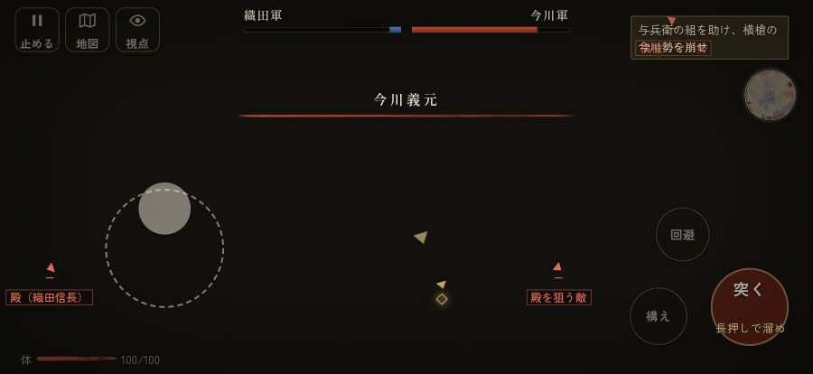

# テストプレイヤーの感想：指揮好きの戦略家

- 人：ケイコ（45歳・将棋と戦略ゲーム好き）（4713番）
- 変わり目：台詞を全部読む・iPhone 横 874×402・新しく始める通し・ゆっくり・足軽から・問屋:鉄砲・一人称・感度 敏感・途中で止める
- 時：2026/10/3 16:32:59（281秒かかった）
- 画面：iPhone の横向き 874×402・倍率3・指で触る操作（touch.js の釦・棒・なぞり）・画質 低
- 遊んだ戦：桶狭間の戦い（達成）
- 機械の混み具合：5（load average）

## ひとこと

> 桶狭間で、号令を0回かけました。HUD の札どうしが重なって読めない。ここが直れば、ぐっと指揮が楽しくなる。行き先があるのに20秒動かない兵。ここが直れば、ぐっと指揮が楽しくなる。前へ進もうとしても進めない所があった。采配の上で、これは痛い。勝てはしましたが、自分の采配で勝った手応えはまだ薄いです。

## 見つけた問題（5件・困った順）

### 1. HUD の札どうしが重なって読めない
- どこで：桶狭間の戦い・5秒・march
- 何が：#armybar と #bark（874×402）／#armybar と #situation（874×402）
- どれくらい困ったか：★★★ やめたくなった（31回）
- 直し方の目安：置き場所をずらすか、片方を出している間はもう片方を隠す
- 画面：（その戦の山場の一枚）

### 2. 行き先があるのに20秒動かない兵
- どこで：桶狭間の戦い・219秒・assault
- 何が：味方の足軽：味方の足軽（号令：attack・織田の足軽組・頭：full/engage・近い敵2m）at (23,-102)／味方の侍：味方の侍（号令：attack・織田の足軽組・頭：full/pursue・近い敵6m逃）at (75,-113)
- どれくらい困ったか：★★★ やめたくなった（10回）
- 直し方の目安：道が塞がれていないか、行き先に着いたと見なせているかを見る
- 画面：（その戦の山場の一枚）

### 3. 前へ進もうとしても進めない所があった
- どこで：桶狭間の戦い・286秒・assault
- 何が：(30, -124)・段 assault
- どれくらい困ったか：★★ かなり困った（1回）
- 直し方の目安：当たり（柵・建物・地形）と道のつながりを見直す
- 画面：

### 4. この戦では号令できる組が無い（指揮する所が無い）
- どこで：桶狭間の戦い・498秒・assault
- 何が：桶狭間の戦い
- どれくらい困ったか：★ 少し気になった（1回）
- 画面：（その戦の山場の一枚）

### 5. 数で勝る隊が、小勢に一方的に削られて崩れた
- どこで：桶狭間の戦い・222秒・assault
- 何が：林の鉄砲組 17 対 そばの敵 1（10を失った）
- どれくらい困ったか：★ 少し気になった（1回）
- 直し方の目安：兵の数の差が、削り合いと士気に効くようにする
- 画面：（その戦の山場の一枚）

## 遊んだ記録

- 桶狭間の戦い：498秒・任務達成・戦功270・組—・討ち取り44・突き96/当たり121・号令0回・指で押した数315・読み込み3.8秒・戦の前の札158字・1コマ12.9ms（実時間233秒・内訳 brain 0.0・pad 0.1・tf 0.4・upd 12.1・eye 0.2）
  - 任務の流れ：0s 組頭の源八と話せ → 1s 組頭の源八と話せ〔済〕 → 4s （任務なし） → 98s 坂の下の今川の先手を突き崩せ → 122s 坂の下の今川の先手を突き崩せ〔済〕 → 128s 坂の下の今川の先手を突き崩せ〔済〕／畦の今川足軽組を押し崩せ（味方の組と並んで） → 179s 坂の下の今川の先手を突き崩せ〔済〕／畦の今川足軽組を押し崩せ（味方の組と並んで）〔済〕 → 195s 坂の下の今川の先手を突き崩せ〔済〕／林の今川の鉄砲組を潰せ（込め直しの間に寄れ） → 222s 坂の下の今川の先手を突き崩せ〔済〕／林の今川の鉄砲組を潰せ（込め直しの間に寄れ）〔済〕 → 245s 与兵衛の組を助け、横槍の今川勢を崩せ／林の今川の鉄砲組を潰せ（込め直しの間に寄れ）〔済〕 → 300s 本陣の前備えを横から突き崩せ／林の今川の鉄砲組を潰せ（込め直しの間に寄れ）〔済〕 → 321s 本陣の前備えを横から突き崩せ〔済〕／林の今川の鉄砲組を潰せ（込め直しの間に寄れ）〔済〕 → 332s 本陣の前備えを横から突き崩せ〔済〕／林の今川の鉄砲組を潰せ（込め直しの間に寄れ）〔済〕／旗本を崩し、味方を義元へ通せ〔済〕 → 342s 引き返す今川勢から本陣の跡を守れ／林の今川の鉄砲組を潰せ（込め直しの間に寄れ）〔済〕／旗本を崩し、味方を義元へ通せ〔済〕
  - 味方の隊：隊104・動いた計11008m・味方の討ち取り198・敵を前に20秒止まった38回・本物の味方5人未満0秒
  - 受けた傷：足軽 48
  - 開戦：
  - 山場：
