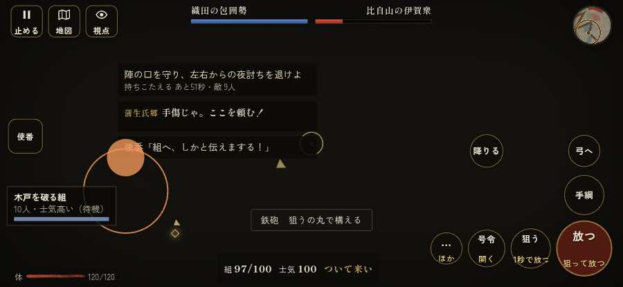

# テストプレイヤーの感想：せっかちな社会人

- 人：ユウキ（35歳・昼休みに遊ぶ会社員）（4744番）
- 変わり目：構え多め・iPhone 横 932×430・信長で出陣・ふつう・身分 上・問屋:鉄砲・三人称・感度 ふつう・途中で止める
- 時：2026/10/3 20:08:16（236秒かかった）
- 画面：iPhone の横向き 932×430・倍率3・指で触る操作（touch.js の釦・棒・なぞり）・画質 低
- 遊んだ戦：天正伊賀の乱・比自山城（信長で出陣）（達成）
- 機械の混み具合：5（load average）

## ひとこと

> 昼休みに7分ほど。天正伊賀の乱・比自山城（信長で出陣）。前へ進もうとしても進めない所があった。ここで閉じる人は多いと思う。戦が始まるまでの読み込みが長い。正直、飛ばしたい。同じ知らせが20秒に4回以上。待ってられない。読み込みも12秒待たされた。勝ち負けはすぐ分かって、そこは良かった。

## 見つけた問題（5件・困った順）

### 1. 同じ知らせが20秒に4回以上
- どこで：天正伊賀の乱・比自山城（信長で出陣）・66秒・raid
- 何が：「鉄砲組が1人を倒した」（報せ）／「足軽たち「あやつを討ち取った！」」（報せ）
- どれくらい困ったか：★★ かなり困った（7回）
- 直し方の目安：一度出したら、しばらく同じ物を出さない
- 画面：（その戦の山場の一枚）

### 2. 前へ進もうとしても進めない所があった
- どこで：天正伊賀の乱・比自山城（信長で出陣）・33秒・raid
- 何が：(-19, 27)・段 raid
- どれくらい困ったか：★★ かなり困った（2回）
- 直し方の目安：当たり（柵・建物・地形）と道のつながりを見直す
- 画面：

### 3. 戦が始まるまでの読み込みが長い
- どこで：天正伊賀の乱・比自山城（信長で出陣）
- 何が：天正伊賀の乱・比自山城（信長で出陣）：押してから 12.0秒（機械が混んでいる時の値）
- どれくらい困ったか：★★ かなり困った（1回）
- 直し方の目安：読み込みの間に、戦の心得を読ませる／重い物を後から足す
- 画面：（その戦の山場の一枚）

### 4. 前へ進もうとしても進めない所があった
- どこで：天正伊賀の乱・比自山城（信長で出陣）・184秒・gate
- 何が：(-7, 56)・段 gate
- どれくらい困ったか：★★ かなり困った（1回）
- 直し方の目安：当たり（柵・建物・地形）と道のつながりを見直す
- 画面：（その戦の山場の一枚）

### 5. 行き先があるのに20秒動かない兵
- どこで：天正伊賀の乱・比自山城（信長で出陣）・190秒・gate
- 何が：味方の鉄砲：味方の鉄砲（号令：attack・名なし・頭：無/―・近い敵115m）at (-10,38)／味方の鉄砲：味方の鉄砲（号令：attack・名なし・頭：無/―・近い敵116m）at (-10,40)
- どれくらい困ったか：★ 少し気になった（8回）
- 直し方の目安：道が塞がれていないか、行き先に着いたと見なせているかを見る
- 画面：（その戦の山場の一枚）

## 遊んだ記録

- 天正伊賀の乱・比自山城（信長で出陣）：399秒・任務達成・戦功188・組94/100・討ち取り1・突き0/当たり13・号令14回・指で押した数403・読み込み12.0秒・戦の前の札215字・1コマ20ms（実時間192秒・内訳 brain 0.0・pad 0.3・tf 0.4・upd 19.1・eye 0.1）
  - 任務の流れ：0s 陣の見張りを見回れ → 4s 小屋の火を消し、忍び込んだ伊賀衆を討て → 104s 陣の口で組をそろえ、次の夜討ちに備えよ → 112s 陣の口で組をそろえ、次の夜討ちに備えよ／陣の口を守り、左右からの夜討ちを退けよ → 183s 南の土橋で木戸の組を守れ → 258s 陣の口へ退き、組をそろえて山の麓を囲め → 266s 陣の口へ退き、組をそろえて山の麓を囲め／陣の口を守れ。城から出る伊賀衆を押し返せ → 336s 夜明けまで陣の口を守れ。山中へ追うな → 360s 開いた木戸から、主郭と北の曲輪を調べよ／山道を上り、開いた南の木戸へ進め → 370s 開いた木戸から、主郭と北の曲輪を調べよ／木戸をくぐり、寺跡の主郭を調べよ → 376s 開いた木戸から、主郭と北の曲輪を調べよ／空堀の道を越え、北の曲輪を調べよ → 381s 北の曲輪で組をそろえ、物見の報せを待て／空堀の道を越え、北の曲輪を調べよ〔済〕 → 385s 北の曲輪で組をそろえ、物見の報せを待て → 389s 比自山城の曲輪を押さえた〔済〕
  - 味方の隊：隊8・動いた計2543m・味方の討ち取り57・敵を前に20秒止まった6回・本物の味方5人未満0秒
  - 受けた傷：鉄砲 51・弓 22・足軽 19・侍 2
  - 開戦：
  - 山場：
