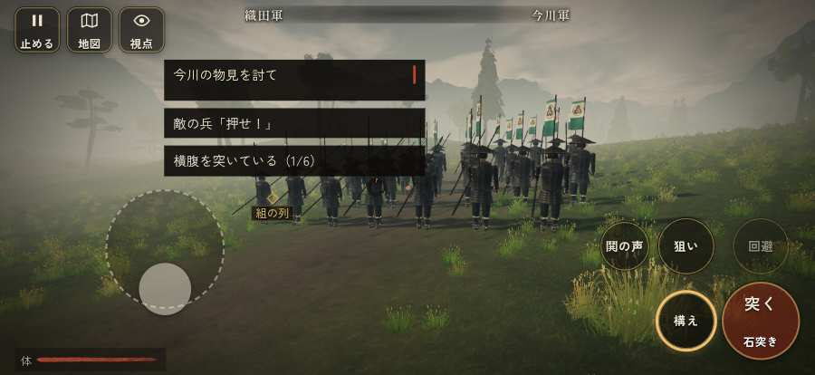

# テストプレイヤーの感想：はじめての中学生

- 人：ハルト（13歳・中学一年）（5195番）
- 変わり目：迷子になりやすい・iPhone 横 874×402・新しく始める通し・速い・足軽から・問屋:馬・一人称・感度 敏感・止めない
- 時：2026/10/4 3:04:50（192秒かかった）
- 画面：iPhone の横向き 874×402・倍率3・指で触る操作（touch.js の釦・棒・なぞり）・画質 低
- 遊んだ戦：桶狭間の戦い（失敗）
- 機械の混み具合：4（load average）

## ひとこと

> とりあえずやってみた。桶狭間をやった。よく分かんないまま終わった。「「狙い」をしたいのに、押す丸が出ていない」のとこ、ムリ。「「鼓舞」をしたいのに、押す丸が出ていない」のとこ、マジで意味わかんない。「字と背景の明暗の比が低い」のとこ、ふつうに困った。ぶっちゃけ、ここで一回やめかけた。

## 見つけた問題（4件・困った順）

### 1. 字と背景の明暗の比が低い（3 未満）
- どこで：桶狭間の戦い・戦のあと
- 何が：.zk-toast > div > small：2.3「実績を得た」／.zk-toast > div > b：1.1「初陣」
- どれくらい困ったか：★★★ やめたくなった（3回）
- 直し方の目安：字を明るく、または背景を暗く
- 画面：（その戦の山場の一枚）

### 2. 押せる所が画面の外にある
- どこで：桶狭間の戦い・165秒・assault
- 何が：#subtitle > .sp.grunt > .word-help「足軽」 at -24,124／#subtitle > span > .word-help「殿」 at -24,161
- どれくらい困ったか：★★ かなり困った（2回）
- 直し方の目安：画面の内に収めるか、スクロールできるようにする
- 画面：（その戦の山場の一枚）

### 3. 「狙い」をしたいのに、押す丸が出ていない
- どこで：桶狭間の戦い・26秒・march
- 何が：欲しかった時：桶狭間の戦い・26秒・march
- どれくらい困ったか：★ 少し気になった（38回）
- 直し方の目安：その時に使える釦は出す（touchFrame の出し入れ）
- 画面：（その戦の山場の一枚）

### 4. 「鼓舞」をしたいのに、押す丸が出ていない
- どこで：桶狭間の戦い・19秒・march
- 何が：欲しかった時：桶狭間の戦い・19秒・march
- どれくらい困ったか：★ 少し気になった（17回）
- 直し方の目安：その時に使える釦は出す（touchFrame の出し入れ）
- 画面：（その戦の山場の一枚）

## 遊んだ記録

- 桶狭間の戦い：488秒・任務失敗・戦功0・組—・討ち取り1・突き83/当たり4・号令0回・指で押した数1148・読み込み5.5秒・戦の前の札138字・1コマ9.5ms（実時間123秒・内訳 brain 0.1・pad 0.4・tf 1.0・upd 7.9・eye 0.1）
  - 任務の流れ：0s 源八の印へ歩き、近くで話せ → 2s 源八の印へ歩き、近くで話せ〔済〕 → 5s （任務なし） → 107s 坂の下の今川の先手を突き崩せ → 167s 組を集め、畦へ進む下知を待て → 168s 組のそばで息を整え、次の下知を待て → 173s 畦の今川足軽組を押し崩せ（味方の組と並んで） → 248s 攻め方の札を選び、組に下知せよ → 264s 林の今川の鉄砲組を潰せ（込め直しの間に寄れ） → 324s 与兵衛を助けるか、本陣へ進むか選べ → 345s 与兵衛の組を助け、横槍の今川勢を崩せ → 400s 本陣の前備えを横から突き崩せ → 465s 本陣の口へ押すか、輿の先へ回るか選べ → 467s 本陣の口へ押すか、輿の先へ回るか選べ／組と共に本陣から退け
  - 味方の隊：隊45・動いた計3835m・味方の討ち取り68・敵を前に20秒止まった3回・本物の味方5人未満20秒
  - 開戦：
  - 山場：
  - 勝ち負けが決まった所：
