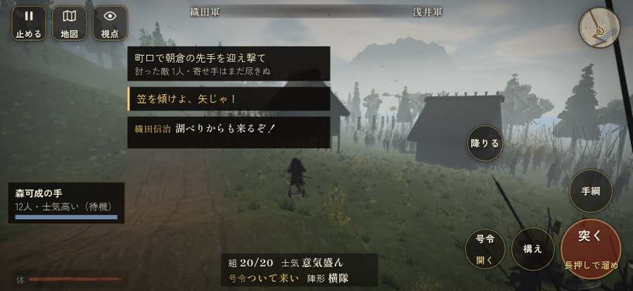

# テストプレイヤーの感想：歴史好きの大人

- 人：ミチオ（62歳・郷土史の会）（5291番）
- 変わり目：台詞を全部読む・iPhone 横 874×402・新しく始める通し・ふつう・身分 少し上・問屋:買わない・一人称・感度 敏感・止めない
- 時：2026/10/4 2:45:12（235秒かかった）
- 画面：iPhone の横向き 874×402・倍率3・指で触る操作（touch.js の釦・棒・なぞり）・画質 低
- 遊んだ戦：志賀の陣・宇佐山城（達成）
- 機械の混み具合：5（load average）

## ひとこと

> 志賀の陣・宇佐山城を、一人称で歩いて見て回りました。務めは果たせましたが、気になる所がいくつか。前へ進もうとしても進めない所があった。これでは興が醒めます。敵が近いのに、まわりの兵の多くが棒立ち。当時の人が見たら首を傾げるでしょう。自分のすぐそばの敵が6秒以上なにもしない。当時の人が見たら首を傾げるでしょう。

## 見つけた問題（4件・困った順）

### 1. 自分のすぐそばの敵が6秒以上なにもしない
- どこで：志賀の陣・宇佐山城・313秒・siege
- 何が：敵の足軽：敵の足軽
- どれくらい困ったか：★★★ やめたくなった（3回）
- 直し方の目安：近くの敵（遊び手）を狙いに入れる
- 画面：（その戦の山場の一枚）

### 2. 前へ進もうとしても進めない所があった
- どこで：志賀の陣・宇佐山城・88秒・first
- 何が：(36, -21)・段 first
- どれくらい困ったか：★★ かなり困った（1回）
- 直し方の目安：当たり（柵・建物・地形）と道のつながりを見直す
- 画面：（その戦の山場の一枚）

### 3. 敵が近いのに、まわりの兵の多くが棒立ち
- どこで：志賀の陣・宇佐山城・220秒・siege
- 何が：220秒：まわり35mの6人のうち6人が止まったまま（段 siege）
- どれくらい困ったか：★★ かなり困った（1回）
- 直し方の目安：敵が30m内に入ったら、構える・にじり寄る・槍を揃えるなど体を動かす
- 画面：（その戦の山場の一枚）

### 4. 数で勝る隊が、小勢に一方的に削られて崩れた
- どこで：志賀の陣・宇佐山城・392秒・relief
- 何が：木戸へ迫る最後の寄せ手 損害が出始めた時12 対 戦った敵は最多2（8を失った）
- どれくらい困ったか：★ 少し気になった（1回）
- 直し方の目安：兵の数の差が、削り合いと士気に効くようにする
- 画面：（その戦の山場の一枚）

## 遊んだ記録

- 志賀の陣・宇佐山城：444秒・任務達成・戦功165・組8/28・討ち取り7・突き17/当たり16・号令0回・指で押した数81・読み込み5.6秒・戦の前の札190字・1コマ14.7ms（実時間162秒・内訳 brain 0.2・pad 0.1・tf 0.2・upd 14.2・eye 0.1）
  - 任務の流れ：0s 森可成の下で町口の一手を預かり、坂本の町口を固めよ → 27s 町口で朝倉の先手を迎え撃て → 92s 町口の左右から来る敵を受け止めよ → 147s 宇佐山城へ退け → 200s 城兵の一手を率いて宇佐山城に籠り、三の丸→二の丸→本丸の順に木戸を守れ（上様の後詰まで） → 325s 城の内に踏みとどまり、後詰を待て → 410s 城の内に踏みとどまり、後詰を待て〔済〕
  - 味方の隊：隊21・動いた計613m・味方の討ち取り61・敵を前に20秒止まった28回・本物の味方5人未満0秒
  - 受けた傷：侍 81・足軽 11・鉄砲 8
  - 開戦：
  - 一人称で見回す（45秒）：
  - 山場：
