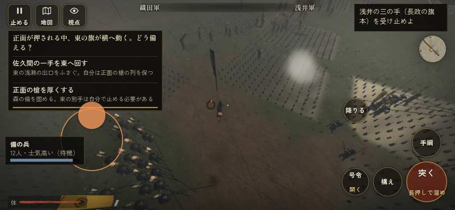

# テストプレイヤーの感想：はじめての中学生

- 人：ハルト（13歳・中学一年）（5710番）
- 変わり目：走りっぱなし・iPhone 横 932×430・織田家編の戦を一つ・ふつう・身分 少し上・問屋:買わない・一人称・感度 ふつう・途中で止める
- 時：2026/10/4 15:24:43（238秒かかった）
- 画面：iPhone の横向き 932×430・倍率3・指で触る操作（touch.js の釦・棒・なぞり）・画質 低
- 遊んだ戦：姉川の戦い（達成・倒れた）
- 機械の混み具合：4（load average）

## ひとこと

> とりあえずやってみた。姉川をやった。1回はなんかクリアできた。1回すぐ死んだ…。「前へ進もうとしても進めない所があった」のとこ、だるい。「「狙い」をしたいのに、押す丸が出ていない」のとこ、ムリ。「大見出しが3つ以上たまっている」のとこ、ふつうに困った。ぶっちゃけ、ここで一回やめかけた。

## 見つけた問題（7件・困った順）

### 1. 大見出しが3つ以上たまっている（出るのが遅れる）
- どこで：姉川の戦い・157秒・charge
- 何が：「稲葉一鉄、浅井の横腹へ　西美濃の衆が東から駆けつける」／「深手　組の者が駆け寄ってくる」
- どれくらい困ったか：★★★ やめたくなった（8回）
- 直し方の目安：重要でない見出しを字幕や報せに回す
- 画面：（その戦の山場の一枚）

### 2. 同じ知らせが20秒に4回以上
- どこで：姉川の戦い・51秒・charge
- 何が：「備の兵、崩れました」（報せ）
- どれくらい困ったか：★★★ やめたくなった（4回）
- 直し方の目安：一度出したら、しばらく同じ物を出さない
- 画面：（その戦の山場の一枚）

### 3. 前へ進もうとしても進めない所があった
- どこで：姉川の戦い・34秒・charge
- 何が：(-40, 90)・段 charge
- どれくらい困ったか：★★ かなり困った（3回）
- 直し方の目安：当たり（柵・建物・地形）と道のつながりを見直す
- 画面：

### 4. 前へ進もうとしても進めない所があった
- どこで：姉川の戦い・363秒・counter
- 何が：(29, 14)・段 counter
- どれくらい困ったか：★★ かなり困った（2回）
- 直し方の目安：当たり（柵・建物・地形）と道のつながりを見直す
- 画面：（その戦の山場の一枚）

### 5. 「狙い」をしたいのに、押す丸が出ていない
- どこで：姉川の戦い・257秒・counter
- 何が：欲しかった時：姉川の戦い・257秒・counter
- どれくらい困ったか：★ 少し気になった（15回）
- 直し方の目安：その時に使える釦は出す（touchFrame の出し入れ）
- 画面：（その戦の山場の一枚）

### 6. すぐに倒れてしまった
- どこで：姉川の戦い・471秒・counter
- 何が：471秒で倒れた（受けた傷：侍 61・騎馬 47・足軽 31）
- どれくらい困ったか：★ 少し気になった（1回）
- 直し方の目安：初めの戦は受ける傷を減らす・危ない時に字幕で構えを教える
- 画面：（その戦の山場の一枚）

### 7. 遊び手を責める言い回し
- どこで：姉川の戦い・181秒・charge
- 何が：「味方「しっかりせい……！　まだ死ぬな！」」（報せ）
- どれくらい困ったか：★ 少し気になった（1回）
- 直し方の目安：責めずに、次にどうすればよいかを言う
- 画面：（その戦の山場の一枚）

## 遊んだ記録

- 姉川の戦い：471秒・任務達成（倒れた）・戦功145・組0/20・討ち取り7・突き293/当たり33・号令0回・指で押した数2776・読み込み4.3秒・戦の前の札182字・1コマ14.6ms（実時間162秒・内訳 brain 0.1・pad 0.8・tf 0.8・upd 12.8・eye 0.1）
  - 任務の流れ：0s 森の備の先手の一手を預かり、浅井の寄せを受け止めよ → 3s 磯野員昌の突撃を受け止めよ → 137s 浅井の三の手（長政の旗本）を受け止めよ → 188s 浅井の三の手（長政の旗本）を受け止めよ／組を集め、息を整えよ → 197s 浅井の三の手（長政の旗本）を受け止めよ／槍の列を保ち、浅井の寄せを押し返せ → 241s 浅井の三の手（長政の旗本）を受け止めよ〔済〕／槍の列を保ち、浅井の寄せを押し返せ〔失〕／姉川を渡り、向こう岸で踏みとどまる浅井の殿（しんがり）を崩せ → 326s 浅井の三の手（長政の旗本）を受け止めよ〔済〕／組を集め、息を整えよ／姉川を渡り、向こう岸で踏みとどまる浅井の殿（しんがり）を崩せ〔失〕 → 335s 浅井の三の手（長政の旗本）を受け止めよ〔済〕／長政の本陣の後備えを崩せ／姉川を渡り、向こう岸で踏みとどまる浅井の殿（しんがり）を崩せ〔失〕 → 430s 浅井の三の手（長政の旗本）を受け止めよ〔済〕／組を集め、息を整えよ／姉川を渡り、向こう岸で踏みとどまる浅井の殿（しんがり）を崩せ〔失〕
  - 味方の隊：隊46・動いた計3659m・味方の討ち取り56・敵を前に20秒止まった20回・本物の味方5人未満0秒
  - 受けた傷：侍 61・騎馬 47・足軽 31
  - 開戦：
  - 山場：
