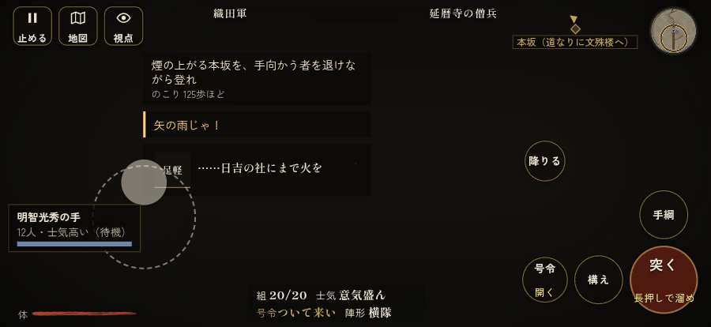

# テストプレイヤーの感想：歴史好きの大人

- 人：ミチオ（62歳・郷土史の会）（5796番）
- 変わり目：連打・iPhone 横 874×402・新しく始める通し・速い・身分 少し上・問屋:刀・槍・具足・三人称・感度 ふつう・止めない
- 時：2026/10/4 19:59:56（225秒かかった）
- 画面：iPhone の横向き 874×402・倍率3・指で触る操作（touch.js の釦・棒・なぞり）・画質 低
- 遊んだ戦：比叡山攻め（失敗・倒れた）
- 機械の混み具合：5（load average）

## ひとこと

> 比叡山攻めを、一人称で歩いて見て回りました。務めは果たせませんでしたが、それより気になる所があります。敵が近いのに、まわりの兵の多くが棒立ち。史実を知る者としては、ここは看過できません。行き先があるのに20秒動かない兵。これでは興が醒めます。倒れて戦が終わった。これでは興が醒めます。

## 見つけた問題（4件・困った順）

### 1. 行き先があるのに20秒動かない兵
- どこで：比叡山攻め・58秒・climb
- 何が：味方の足軽：味方の足軽（号令：path・明智光秀の手・頭：無/―・近い敵11m逃）at (142,-12)／味方の足軽：味方の足軽（号令：path・明智光秀の手・頭：無/―・近い敵23m）at (30,-8)
- どれくらい困ったか：★★★ やめたくなった（5回）
- 直し方の目安：道が塞がれていないか、行き先に着いたと見なせているかを見る
- 画面：（その戦の山場の一枚）

### 2. 敵が近いのに、まわりの兵の多くが棒立ち
- どこで：比叡山攻め・425秒・climb
- 何が：425秒：まわり35mの14人のうち6人が止まったまま（段 climb）
- どれくらい困ったか：★★ かなり困った（6回）
- 直し方の目安：敵が30m内に入ったら、構える・にじり寄る・槍を揃えるなど体を動かす
- 画面：（その戦の山場の一枚）

### 3. 倒れて戦が終わった
- どこで：比叡山攻め・526秒・end
- 何が：526秒で倒れた（受けた傷：足軽 99・弓 5）
- どれくらい困ったか：★ 少し気になった（1回）
- 直し方の目安：初めの戦は受ける傷を減らす・危ない時に字幕で構えを教える
- 画面：（その戦の山場の一枚）

### 4. 兵が一息で飛んだ（6m 超）
- どこで：比叡山攻め・328秒・climb
- 何が：敵の足軽：敵の足軽：(-133,-42) → (-140,-42)
- どれくらい困ったか：★ 少し気になった（1回）
- 直し方の目安：位置を直接書き換えている所を探す（出し直し・押し出し）
- 画面：（その戦の山場の一枚）

## 遊んだ記録

- 比叡山攻め：526秒・任務失敗（倒れた）・戦功0・組8/20・討ち取り15・突き272/当たり31・号令0回・指で押した数4604・読み込み9.8秒・戦の前の札182字・1コマ12ms（実時間164秒・内訳 brain 0.1・pad 1.2・tf 1.0・upd 9.6・eye 0.1）
  - 任務の流れ：0s 明智光秀の先手の一隊を預かり、坂本から山へ登れ → 5s 日吉社の鳥居の前の僧兵を退け、本坂の登り口へ → 36s 煙の上がる本坂を、手向かう者を退けながら登れ → 170s 文殊楼を抜け、燃える堂の間の山道へ進め → 205s 燃える根本中堂の前を抜け、山道を西塔へ掃討せよ → 249s 燃える東塔を抜け、西塔へ続く山道を掃討せよ → 328s 浄土院を荒らさず抜け、燃える西塔の山道を掃討せよ → 478s 逃げ惑う人々を追わず、横川への山道を掃討せよ → 485s 逃げ惑う人々を追わず、横川への山道を掃討せよ〔失〕
  - 味方の隊：隊5・動いた計1090m・味方の討ち取り43・敵を前に20秒止まった3回・本物の味方5人未満0秒
  - 受けた傷：足軽 99・弓 5
  - 開戦：
  - 山場：
  - 一人称で見回す（104秒）：
