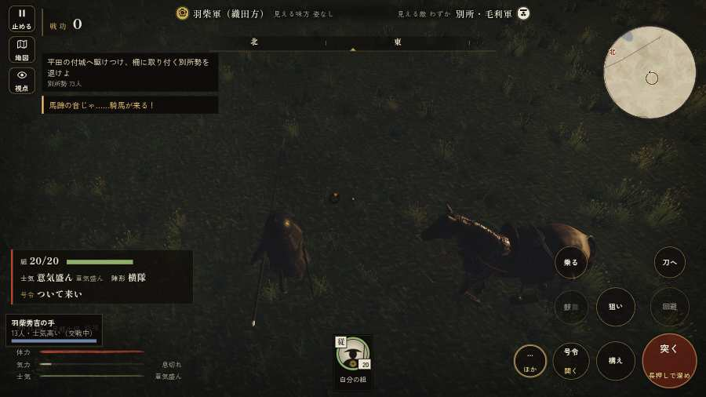

# テストプレイヤーの感想：アクション好き

- 人：ソウタ（24歳・アクションゲーム好き）（5812番）
- 変わり目：連打・パソコン 1280×720・織田家編の戦を一つ・速い・身分 上・問屋:供・三人称・感度 ふつう・止めない
- 時：2026/10/4 19:46:23（194秒かかった）
- 画面：パソコン 1280×720・鍵盤とマウス・画質 低
- 遊んだ戦：三木城・大村の合戦（達成）
- 機械の混み具合：4（load average）

## ひとこと

> とにかく突っ込んだ。13分で0人斬った。908回突いて0回当たり。当たらなさすぎ。「狙い」をしたいのに、押す丸が出ていない、ストレスたまる。字が枠から切れている、手応えがスカスカ。突いても、なかなか当たらない、手応えがスカスカ。もっと派手に、じゃなくて重く斬り合いたい。

## 見つけた問題（5件・困った順）

### 1. 字が枠から切れている
- どこで：三木城・大村の合戦・20秒・convoy
- 何が：#h-units > .uc.ally > .nm「1 羽柴秀吉」／#h-units > .uc.ally > .nm「2 谷衛好」
- どれくらい困ったか：★★ かなり困った（55回）
- 直し方の目安：枠を広げるか、字を折り返す
- 画面：（その戦の山場の一枚）

### 2. 突いても、なかなか当たらない
- どこで：三木城・大村の合戦・786秒・end
- 何が：908回振り、門・柵に当たった振り0回、兵に当たった振り0回
- どれくらい困ったか：★★ かなり困った（1回）
- 直し方の目安：狙いの補助と、敵まで通れる道・間合いを確かめる
- 画面：（その戦の山場の一枚）

### 3. 「狙い」をしたいのに、押す丸が出ていない
- どこで：三木城・大村の合戦・51秒・convoy
- 何が：欲しかった時：三木城・大村の合戦・51秒・convoy
- どれくらい困ったか：★ 少し気になった（48回）
- 直し方の目安：その時に使える釦は出す（touchFrame の出し入れ）
- 画面：（その戦の山場の一枚）

### 4. 数で勝る隊が、小勢に一方的に削られて崩れた
- どこで：三木城・大村の合戦・378秒・hirata
- 何が：殿を狙う敵 損害が出始めた時10 対 戦った敵は最多1（6を失った）／殿を狙う敵 損害が出始めた時10 対 戦った敵は最多2（4を失った）
- どれくらい困ったか：★ 少し気になった（2回）
- 直し方の目安：兵の数の差が、削り合いと士気に効くようにする
- 画面：（その戦の山場の一枚）

### 5. 斬り合う相手が少なくて退屈
- どこで：三木城・大村の合戦・786秒・end
- 何が：13分で0人
- どれくらい困ったか：★ 少し気になった（1回）
- 画面：（その戦の山場の一枚）

## 遊んだ記録

- 三木城・大村の合戦：786秒・任務達成・戦功190・組20/20・討ち取り0・突き908/当たり0・号令0回・指で押した数7034・読み込み3.5秒・戦の前の札216字・1コマ8.9ms（実時間154秒・内訳 brain 0.1・pad 0.8・tf 0.0・upd 7.9・eye 0.1）
  - 任務の流れ：0s 足軽の一手を預かり、羽柴秀吉の下知を待て → 3s 荷駄の護衛を退け、荷を奪え → 58s 捨てられた兵糧の俵を奪え（2か所） → 88s 平田の付城へ駆けつけ、柵に取り付く別所勢を退けよ → 173s 平田の付城の一手を預かり、別所・毛利勢を城へ入れるな → 202s 平田の付城の一手を預かり、別所・毛利勢を城へ入れるな／預かった一手で付城の口を固め、囲みに来る別所勢を退けよ → 301s 平田の付城の一手を預かり、別所・毛利勢を城へ入れるな／預かった一手で付城の口を固め、囲みに来る別所勢を退けよ〔失〕 → 305s 平田の付城の一手を預かり、別所・毛利勢を城へ入れるな → 330s 平田の付城の一手を預かり、別所・毛利勢を城へ入れるな／預かった一手で西の谷道を塞ぎ、毛利の荷駄を焼け → 440s 大村坂で、別所・毛利勢を崩せ／預かった一手で西の谷道を塞ぎ、毛利の荷駄を焼け〔失〕 → 525s 預かった一手で大村坂を押さえ、城の者を二度と出すな／預かった一手で西の谷道を塞ぎ、毛利の荷駄を焼け〔失〕 → 529s 預かった一手で大村坂を押さえ、城の者を二度と出すな → 555s 預かった一手で大村坂を押さえ、城の者を二度と出すな／預かった一手で追い討ち、城の手前で別所勢を崩せ → 665s 預かった一手で大村坂を押さえ、城の者を二度と出すな／預かった一手を坂の上に並べ、城からの最後の打って出を受け止めよ
  - 味方の隊：隊14・動いた計2786m・味方の討ち取り89・敵を前に20秒止まった7回・本物の味方5人未満0秒
  - 開戦：
  - 山場：
  - 勝ち負けが決まった所：
