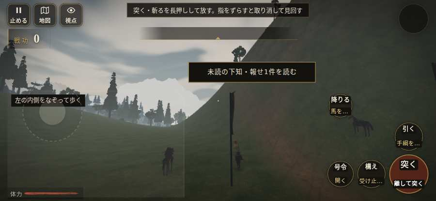
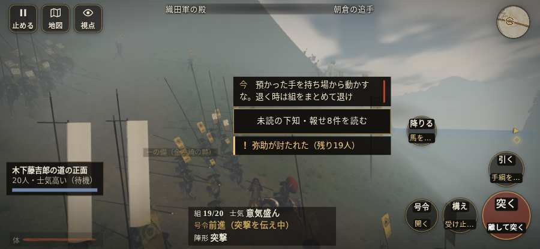

# テストプレイヤーの感想：指揮好きの戦略家

- 人：ケイコ（45歳・将棋と戦略ゲーム好き）（6208番）
- 変わり目：走りっぱなし・iPhone 横 932×430・織田家編の戦を一つ・速い・足軽から・問屋:刀・槍・具足・一人称・感度 鈍い・止めない
- 時：2026/10/5 2:34:07（133秒かかった）
- 画面：iPhone の横向き 932×430・倍率3・指で触る操作（touch.js の釦・棒・なぞり）・画質 低
- 遊んだ戦：金ヶ崎の退き口（失敗）
- 機械の混み具合：4（load average）

## ひとこと

> 金ヶ崎の退き口で、号令を19回かけました。HUD の札どうしが重なって読めない。ここが直れば、ぐっと指揮が楽しくなる。号令「陣形」が、指の号令の輪から出せない。ここが直れば、ぐっと指揮が楽しくなる。戦場が札に食われている。命令が信用できないと、策が立てられません。采配で負けたのか、操作で負けたのか分からないのが一番困ります。

## 見つけた問題（8件・困った順）

### 1. HUD の札どうしが重なって読めない
- どこで：金ヶ崎の退き口・開戦
- 何が：#markers と #minimap（932×430）／#markers と #battle-log-entry（932×430）
- どれくらい困ったか：★★★ やめたくなった（274回）
- 直し方の目安：置き場所をずらすか、片方を出している間はもう片方を隠す
- 画面：（その戦の山場の一枚）

### 2. 戦場が札に食われている（画面の3分の1超）
- どこで：金ヶ崎の退き口・開戦
- 何が：932×430 で 100%
- どれくらい困ったか：★★★ やめたくなった（40回）
- 直し方の目安：札を小さくするか、平時は薄く・畳む
- 画面：（その戦の山場の一枚）

### 3. 号令「陣形」が、指の号令の輪から出せない
- どこで：金ヶ崎の退き口・2秒・brief
- 何が：号令の輪（RADIAL）に無い、または身分が足りず選べない（金ヶ崎の退き口・2秒・brief）
- どれくらい困ったか：★★★ やめたくなった（3回）
- 直し方の目安：号令の輪に足すか、短く押した時の指揮の札（数字の号令）を指で押せるようにする
- 画面：（その戦の山場の一枚）

### 4. 号令「突撃」から3秒たっても、組の7割が動かない
- どこで：金ヶ崎の退き口・35秒・l1
- 何が：19人のうち動いたのは0人（金ヶ崎の退き口・35秒・l1）
- どれくらい困ったか：★★ かなり困った（7回）
- 直し方の目安：号令を受けた兵がすぐ向きを変えて動き出すようにする（行き先・狙いの付け直し）
- 画面：

### 5. 「右側のなぞり（見回す）」を押そうとしたら、別の物に当たった
- どこで：金ヶ崎の退き口・0秒・brief
- 何が：指の下にあったのは #hud > #battle-notices > #battle-log-entry.btn.small「未読の下知・報せ1件を読む」
- どれくらい困ったか：★★ かなり困った（1回）
- 直し方の目安：重ねている札の置き場所をずらすか、pointer-events:none にする
- 画面：

### 6. 号令「続け」から3秒たっても、組の7割が動かない
- どこで：金ヶ崎の退き口・45秒・l1
- 何が：19人のうち動いたのは0人（金ヶ崎の退き口・45秒・l1）
- どれくらい困ったか：★★ かなり困った（1回）
- 直し方の目安：号令を受けた兵がすぐ向きを変えて動き出すようにする（行き先・狙いの付け直し）
- 画面：（その戦の山場の一枚）

### 7. 号令「突撃」を出したが、組の多くが戦列を離れている
- どこで：金ヶ崎の退き口・104秒・back1
- 何が：9人のうち逃亡・負傷で動けない兵は9人（金ヶ崎の退き口・104秒・back1）
- どれくらい困ったか：★ 少し気になった（1回）
- 直し方の目安：組が崩れた理由を確かめ、旗のそばで退避と立て直しを行う
- 画面：（その戦の山場の一枚）

### 8. 号令「続け」を出したが、組の多くが戦列を離れている
- どこで：金ヶ崎の退き口・137秒・back1
- 何が：12人のうち逃亡・負傷で動けない兵は12人（金ヶ崎の退き口・137秒・back1）
- どれくらい困ったか：★ 少し気になった（1回）
- 直し方の目安：組が崩れた理由を確かめ、旗のそばで退避と立て直しを行う
- 画面：（その戦の山場の一枚）

## 遊んだ記録

- 金ヶ崎の退き口：192秒・任務失敗・戦功10・組15/35・討ち取り1・突き5/当たり5・号令19回・指で押した数30・読み込み5.1秒・戦の前の札273字・1コマ21.2ms（実時間100秒・内訳 brain 0.1・pad 0.1・tf 0.2・upd 20.6・eye 0.1）
  - 任務の流れ：0s しんがりの一手を預かり、朝倉勢を止めて主力を退かせよ → 37s しんがりの一手を預かり、朝倉勢を止めて主力を退かせよ／一の備（金ヶ崎の麓）を守れ。退けの下知を待て → 102s しんがりの一手を預かり、朝倉勢を止めて主力を退かせよ／一の備（金ヶ崎の麓）を守れ。退けの下知を待て〔済〕 → 192s しんがりの一手を預かり、朝倉勢を止めて主力を退かせよ〔失〕／一の備（金ヶ崎の麓）を守れ。退けの下知を待て〔済〕
  - 味方の隊：隊28・動いた計1751m・味方の討ち取り49・敵を前に20秒止まった13回・本物の味方5人未満0秒
  - 受けた傷：足軽 1
  - 開戦：
