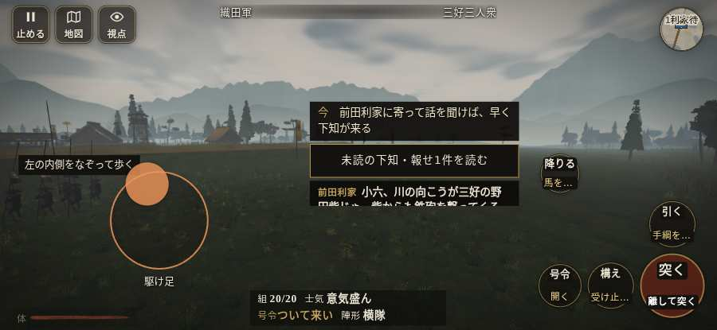

# テストプレイヤーの感想：せっかちな社会人

- 人：ユウキ（35歳・昼休みに遊ぶ会社員）（6219番）
- 変わり目：迷子になりやすい・iPhone 横 932×430・織田家編の戦を一つ・ゆっくり・身分 少し上・問屋:鉄砲・一人称・感度 敏感・止めない
- 時：2026/10/5 2:36:20（302秒かかった）
- 画面：iPhone の横向き 932×430・倍率3・指で触る操作（touch.js の釦・棒・なぞり）・画質 低
- 遊んだ戦：野田・福島の戦い（試験の持ち時間で打ち切り）（失敗）
- 機械の混み具合：3（load average）

## ひとこと

> 昼休みに6分ほど。野田・福島（試験の持ち時間で打ち切り）。HUD の札どうしが重なって読めない。正直、飛ばしたい。前へ進もうとしても進めない所があった。時間がもったいない。戦場が札に食われている。時間がもったいない。結局、何分遊べば一区切りなのかが分からない。

## 見つけた問題（6件・困った順）

### 1. HUD の札どうしが重なって読めない
- どこで：野田・福島の戦い・開戦
- 何が：#markers と #minimap（932×430）／#markers と #battle-log-entry（932×430）
- どれくらい困ったか：★★★ やめたくなった（492回）
- 直し方の目安：置き場所をずらすか、片方を出している間はもう片方を隠す
- 画面：（その戦の山場の一枚）

### 2. 戦場が札に食われている（画面の3分の1超）
- どこで：野田・福島の戦い・開戦
- 何が：932×430 で 100%
- どれくらい困ったか：★★ かなり困った（74回）
- 直し方の目安：札を小さくするか、平時は薄く・畳む
- 画面：（その戦の山場の一枚）

### 3. 前へ進もうとしても進めない所があった
- どこで：野田・福島の戦い・33秒・carry
- 何が：(-23, -3)・段 carry
- どれくらい困ったか：★★ かなり困った（9回）
- 直し方の目安：当たり（柵・建物・地形）と道のつながりを見直す
- 画面：

### 4. 何もする事が無いまま待たされた
- どこで：野田・福島の戦い・193秒・carry
- 何が：60秒、任務札が変わらず敵もいない（段 carry）
- どれくらい困ったか：★★ かなり困った（2回）
- 直し方の目安：飛ばせる（canSkip）ようにするか、待つ間にする事を置く
- 画面：（その戦の山場の一枚）

### 5. 「右側のなぞり（見回す）」を押そうとしたら、別の物に当たった
- どこで：野田・福島の戦い・0秒・brief
- 何が：指の下にあったのは #hud > #battle-notices > #battle-log-entry.btn.small「未読の下知・報せ1件を読む」
- どれくらい困ったか：★★ かなり困った（1回）
- 直し方の目安：重ねている札の置き場所をずらすか、pointer-events:none にする
- 画面：

### 6. 戦の前の説明が長い
- どこで：野田・福島の戦い
- 何が：野田・福島の戦い：276字（読むのに1分かかる）
- どれくらい困ったか：★ 少し気になった（1回）
- 直し方の目安：三行ほどに縮め、残りは「くわしく」に畳む
- 画面：（その戦の山場の一枚）

## 遊んだ記録

- 野田・福島の戦い（試験の持ち時間で打ち切り）（戦の任務とは別に、試験全体の持ち時間が尽きた）：363秒・任務失敗・戦功0・組20/20・討ち取り0・突き0/当たり0・号令0回・指で押した数7・読み込み4.5秒・戦の前の札276字・1コマ32.4ms（実時間259秒・内訳 brain 0.1・pad 0.1・tf 0.2・upd 31.8・eye 0.1）
  - 任務の流れ：0s 前田利家に寄って話を聞けば、早く下知が来る → 8s 味方と竹束を堤へ運び、三つ据えよ
  - 味方の隊：隊13・動いた計864m・味方の討ち取り8・敵を前に20秒止まった61回・本物の味方5人未満0秒
  - 開戦：
