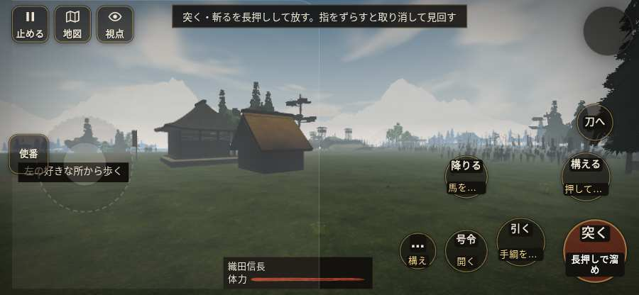

# テストプレイヤーの感想：はじめての中学生

- 人：ハルト（13歳・中学一年）（6555番）
- 変わり目：連打・iPhone 横 844×390・信長で出陣・ゆっくり・足軽から・問屋:鉄砲・三人称・感度 鈍い・止めない
- 時：2026/10/5 18:52:56（120秒かかった）
- 画面：iPhone の横向き 844×390・倍率3・指で触る操作（touch.js の釦・棒・なぞり）・画質 低
- 遊んだ戦：天王寺の戦い（信長で出陣）（失敗・倒れた）
- 機械の混み具合：4（load average）

## ひとこと

> えっと、遊んでみた。天王寺（信長で出陣）をやった。よく分かんないまま終わった。1回すぐ死んだ…。「すぐに倒れてしまった」のとこ、だるい。「「飛ばす」を押そうとしたら、別の物に当たった」のとこ、ふつうに困った。「前へ進もうとしても進めない所があった」のとこ、ふつうに困った。ぶっちゃけ、ここで一回やめかけた。

## 見つけた問題（4件・困った順）

### 1. すぐに倒れてしまった
- どこで：天王寺の戦い（信長で出陣）・45秒・siege
- 何が：40秒で倒れた（受けた傷：侍 55・鉄砲 45）
- どれくらい困ったか：★★★ やめたくなった（1回）
- 直し方の目安：初めの戦は受ける傷を減らす・危ない時に字幕で構えを教える
- 画面：（その戦の山場の一枚）

### 2. 字が枠から切れている
- どこで：天王寺の戦い（信長で出陣）・20秒・siege
- 何が：#obj-list > .main.cur > .obj-text「先手の列を保ち、砦への攻めに備え」
- どれくらい困ったか：★★ かなり困った（6回）
- 直し方の目安：枠を広げるか、字を折り返す
- 画面：（その戦の山場の一枚）

### 3. 「飛ばす」を押そうとしたら、別の物に当たった
- どこで：天王寺の戦い（信長で出陣）・8秒・brief
- 何が：指の下にあったのは #view「#view」
- どれくらい困ったか：★★ かなり困った（1回）
- 直し方の目安：重ねている札の置き場所をずらすか、pointer-events:none にする
- 画面：

### 4. 前へ進もうとしても進めない所があった
- どこで：天王寺の戦い（信長で出陣）・33秒・siege
- 何が：(28, -25)・段 siege
- どれくらい困ったか：★★ かなり困った（1回）
- 直し方の目安：当たり（柵・建物・地形）と道のつながりを見直す
- 画面：

## 遊んだ記録

- 天王寺の戦い（信長で出陣）：40秒・任務失敗（倒れた）・戦功0・組100/100・討ち取り0・突き24/当たり0・号令2回・指で押した数131・読み込み5.4秒・戦の前の札98字・1コマ62.4ms（実時間80秒・内訳 brain 0.3・pad 0.6・tf 0.5・upd 60.8・eye 0.2）
  - 任務の流れ：0s 先手と南の住吉口へ進む時を待て → 18s 先手の列を保ち、砦への攻めに備えよ
  - 味方の隊：隊10・動いた計108m・味方の討ち取り10・敵を前に20秒止まった6回・本物の味方5人未満0秒
  - 受けた傷：侍 55・鉄砲 45
  - 開戦：
