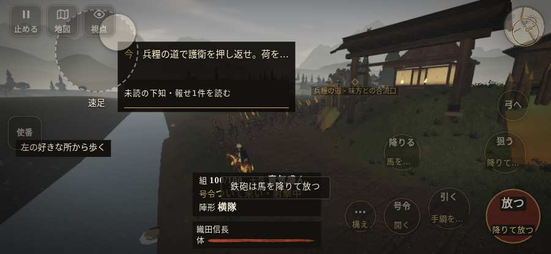

# テストプレイヤーの感想：アクション好き

- 人：ソウタ（24歳・アクションゲーム好き）（6617番）
- 変わり目：走りっぱなし・iPhone 横 844×390・信長で出陣・速い・身分 上・問屋:馬・一人称・感度 敏感・途中で止める
- 時：2026/10/5 19:01:30（304秒かかった）
- 画面：iPhone の横向き 844×390・倍率3・指で触る操作（touch.js の釦・棒・なぞり）・画質 低
- 遊んだ戦：三木城・大村の合戦（信長で出陣）（試験の持ち時間で打ち切り）（失敗）
- 機械の混み具合：2（load average）

## ひとこと

> とにかく突っ込んだ。1分で0人斬った。「親指の棒（歩く）」を押そうとしたら、別の物に当たった、ストレスたまる。字が枠から切れている、手応えがスカスカ。もっと派手に、じゃなくて重く斬り合いたい。

## 見つけた問題（2件・困った順）

### 1. 「親指の棒（歩く）」を押そうとしたら、別の物に当たった
- どこで：三木城・大村の合戦（信長で出陣）・3秒・convoy
- 何が：指の下にあったのは #battle-notices > #objectives > #battle-log-entry.btn.small「未読の下知・報せ1件を読む」
- どれくらい困ったか：★★ かなり困った（1回）
- 直し方の目安：重ねている札の置き場所をずらすか、pointer-events:none にする
- 画面：

### 2. 字が枠から切れている
- どこで：三木城・大村の合戦（信長で出陣）・5秒・convoy
- 何が：#obj-list > .main.cur > .obj-text「兵糧の道で護衛を押し返せ。荷を城」
- どれくらい困ったか：★ 少し気になった（14回）
- 直し方の目安：枠を広げるか、字を折り返す
- 画面：（その戦の山場の一枚）

## 遊んだ記録

- 三木城・大村の合戦（信長で出陣）（試験の持ち時間で打ち切り）（戦の任務とは別に、試験全体の持ち時間が尽きた）：66秒・任務失敗・戦功0・組100/100・討ち取り0・突き0/当たり0・号令2回・指で押した数9・読み込み4.8秒・戦の前の札103字・1コマ176.9ms（実時間261秒・内訳 brain 2.6・pad 0.1・tf 0.5・upd 173.4・eye 0.2）
  - 任務の流れ：0s 下知から六分半で寄せを止め、兵糧の道を守れ → 3s 兵糧の道で護衛を押し返せ。荷を城へ通すな
  - 味方の隊：隊8・動いた計141m・味方の討ち取り8・敵を前に20秒止まった4回・本物の味方5人未満0秒
  - 開戦：
  - 山場：
