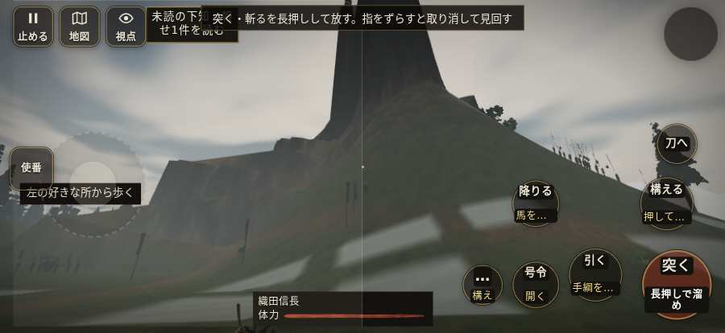

# テストプレイヤーの感想：せっかちな社会人

- 人：ユウキ（35歳・昼休みに遊ぶ会社員）（6879番）
- 変わり目：迷子になりやすい・iPhone 横 874×402・信長で出陣・ゆっくり・身分 上・問屋:馬・一人称・感度 ふつう・途中で止める
- 時：2026/10/6 1:21:20（301秒かかった）
- 画面：iPhone の横向き 874×402・倍率3・指で触る操作（touch.js の釦・棒・なぞり）・画質 低
- 遊んだ戦：金ヶ崎の退き口（信長で出陣）（試験の持ち時間で打ち切り）（失敗）
- 機械の混み具合：3（load average）

## ひとこと

> 昼休みに8分ほど。金ヶ崎の退き口（信長で出陣）（試験の持ち時間で打ち切り）。前へ進もうとしても進めない所があった。ここで閉じる人は多いと思う。味方が味方を傷つけている。待ってられない。何もする事が無いまま待たされた。時間がもったいない。結局、何分遊べば一区切りなのかが分からない。

## 見つけた問題（4件・困った順）

### 1. 味方が味方を傷つけている
- どこで：金ヶ崎の退き口（信長で出陣）・3秒・brief
- 何が：味方の鉄砲：味方の鉄砲 → 味方の鉄砲（26）／敵の弓：敵の弓 → 敵の足軽（0）
- どれくらい困ったか：★★ かなり困った（35回）
- 直し方の目安：狙いの相手を選ぶときに、同じ側を外す
- 画面：（その戦の山場の一枚）

### 2. 前へ進もうとしても進めない所があった
- どこで：金ヶ崎の退き口（信長で出陣）・33秒・l1
- 何が：(-21, 91)・段 l1
- どれくらい困ったか：★★ かなり困った（13回）
- 直し方の目安：当たり（柵・建物・地形）と道のつながりを見直す
- 画面：

### 3. 何もする事が無いまま待たされた
- どこで：金ヶ崎の退き口（信長で出陣）・86秒・l1
- 何が：61秒、任務札が変わらず敵もいない（段 l1）
- どれくらい困ったか：★★ かなり困った（1回）
- 直し方の目安：飛ばせる（canSkip）ようにするか、待つ間にする事を置く
- 画面：

### 4. 一つの戦が長い（7分を超えた）
- どこで：金ヶ崎の退き口（信長で出陣）・494秒・l1
- 何が：金ヶ崎の退き口（信長で出陣）：8分
- どれくらい困ったか：★ 少し気になった（1回）
- 直し方の目安：途中で区切れる所（段の切れ目）に「ここまで」を置く
- 画面：（その戦の山場の一枚）

## 遊んだ記録

- 金ヶ崎の退き口（信長で出陣）（試験の持ち時間で打ち切り）（戦の任務とは別に、試験全体の持ち時間が尽きた）：494秒・任務失敗・戦功0・組100/100・討ち取り0・突き0/当たり0・号令0回・指で押した数4・読み込み3.8秒・戦の前の札123字・1コマ24.7ms（実時間264秒・内訳 brain 0.0・pad 0.1・tf 0.5・upd 23.9・eye 0.2）
  - 任務の流れ：0s 旗本を連れ、若狭へ向かう道まで退け
  - 味方の隊：隊18・動いた計1355m・味方の討ち取り5・敵を前に20秒止まった62回・本物の味方5人未満0秒
  - 開戦：
