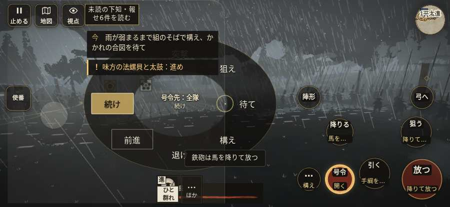

# テストプレイヤーの感想：指揮好きの戦略家

- 人：ケイコ（45歳・将棋と戦略ゲーム好き）（6948番）
- 変わり目：構え多め・iPhone 横 932×430・信長で出陣・ふつう・足軽から・問屋:買わない・三人称・感度 鈍い・途中で止める
- 時：2026/10/6 8:03:22（304秒かかった）
- 画面：iPhone の横向き 932×430・倍率3・指で触る操作（touch.js の釦・棒・なぞり）・画質 低
- 遊んだ戦：桶狭間の戦い（信長で出陣）（試験の持ち時間で打ち切り）（失敗）
- 機械の混み具合：4（load average）

## ひとこと

> 桶狭間（信長で出陣）（試験の持ち時間で打ち切り）で、号令を29回かけました。信長でも出陣して、軍配も触りました。号令「陣形」が、指の号令の輪から出せない。命令が信用できないと、策が立てられません。前へ進もうとしても進めない所があった。指揮官としてはもどかしい。行き先があるのに20秒動かない兵。ここが直れば、ぐっと指揮が楽しくなる。采配で負けたのか、操作で負けたのか分からないのが一番困ります。

## 見つけた問題（3件・困った順）

### 1. 行き先があるのに20秒動かない兵
- どこで：桶狭間の戦い（信長で出陣）・155秒・assault
- 何が：味方の服部小平太：味方の服部小平太（号令：attack・織田信長の本陣・頭：無/―・近い敵17m）at (97,11)／味方の服部小平太：味方の服部小平太（号令：attack・織田信長の本陣・頭：無/―・近い敵18m）at (97,11)
- どれくらい困ったか：★★★ やめたくなった（19回）
- 直し方の目安：道が塞がれていないか、行き先に着いたと見なせているかを見る
- 画面：（その戦の山場の一枚）

### 2. 号令「陣形」が、指の号令の輪から出せない
- どこで：桶狭間の戦い（信長で出陣）・4秒・brief
- 何が：号令の輪（RADIAL）に無い、または身分が足りず選べない（桶狭間の戦い（信長で出陣）・4秒・brief）
- どれくらい困ったか：★★★ やめたくなった（17回）
- 直し方の目安：号令の輪に足すか、短く押した時の指揮の札（数字の号令）を指で押せるようにする
- 画面：（その戦の山場の一枚）

### 3. 前へ進もうとしても進めない所があった
- どこで：桶狭間の戦い（信長で出陣）・33秒・wait
- 何が：(27, -7)・段 wait
- どれくらい困ったか：★★ かなり困った（9回）
- 直し方の目安：当たり（柵・建物・地形）と道のつながりを見直す
- 画面：

## 遊んだ記録

- 桶狭間の戦い（信長で出陣）（試験の持ち時間で打ち切り）（戦の任務とは別に、試験全体の持ち時間が尽きた）：341秒・任務失敗・戦功0・組100/100・討ち取り0・突き0/当たり0・号令29回・指で押した数38・読み込み3.7秒・戦の前の札121字・1コマ35.8ms（実時間267秒・内訳 brain 0.4・pad 0.1・tf 0.5・upd 34.6・eye 0.2）
  - 任務の流れ：0s 今川の備えへかかれ → 4s 今川の備えへかかれ／組頭の下知を聞き、行軍の合図を待て → 7s 今川の備えへかかれ／すぐ先の組の旗について進め → 32s 今川の備えへかかれ／雨が弱まるまで組のそばで構え、かかれの合図を待て → 41s 味方の旗に続き、道の守りを崩せ
  - 味方の隊：隊7・動いた計1357m・味方の討ち取り20・敵を前に20秒止まった16回・本物の味方5人未満0秒
  - 開戦：
  - 終わり近く：
