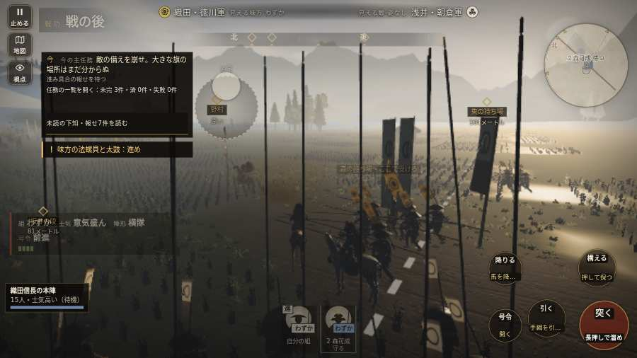

# テストプレイヤーの感想：歴史好きの大人

- 人：ミチオ（62歳・郷土史の会）（7016番）
- 変わり目：構え多め・パソコン 1280×720・新しく始める通し・速い・身分 少し上・問屋:鉄砲・一人称・感度 敏感・途中で止める
- 時：2026/10/6 8:02:33（283秒かかった）
- 画面：パソコン 1280×720・鍵盤とマウス・画質 低
- 遊んだ戦：姉川の戦い（失敗）
- 機械の混み具合：4（load average）

## ひとこと

> 姉川を、一人称で歩いて見て回りました。務めは果たせませんでしたが、それより気になる所があります。「親指の棒（歩く）」を押そうとしたら、別の物に当たった。史実を知る者としては、ここは看過できません。字が枠から切れている。史実を知る者としては、ここは看過できません。旗と甲冑の色の揃い方は、なかなか雰囲気が出ています。

## 見つけた問題（2件・困った順）

### 1. 「親指の棒（歩く）」を押そうとしたら、別の物に当たった
- どこで：姉川の戦い・60秒・charge
- 何が：指の下にあったのは #battle-notices > #battle-message > #subtitle「使番東の浅瀬に浅井の旗！　横」
- どれくらい困ったか：★★ かなり困った（1回）
- 直し方の目安：重ねている札の置き場所をずらすか、pointer-events:none にする
- 画面：

### 2. 字が枠から切れている
- どこで：姉川の戦い・5秒・charge
- 何が：#h-units > .uc.ally > .nm「2 森可成」
- どれくらい困ったか：★ 少し気になった（30回）
- 直し方の目安：枠を広げるか、字を折り返す
- 画面：（その戦の山場の一枚）

## 遊んだ記録

- 姉川の戦い：333秒・任務失敗・戦功20・組13/20・討ち取り0・突き0/当たり0・号令0回・指で押した数7・読み込み4.7秒・戦の前の札238字・1コマ24.1ms（実時間207秒・内訳 brain 0.2・pad 0.1・tf 0.4・upd 23.2・eye 0.2）
  - 任務の流れ：0s 森の備の先手の一手を預かり、浅井の寄せを受け止めよ → 3s 磯野員昌の突撃を受け止めよ → 137s 浅井の新手を受け止めよ → 333s 浅井の新手を受け止めよ〔失〕
  - 味方の隊：隊22・動いた計3508m・味方の討ち取り29・敵を前に20秒止まった20回・本物の味方5人未満0秒
  - 開戦：
  - 一人称で見回す（45秒）：
