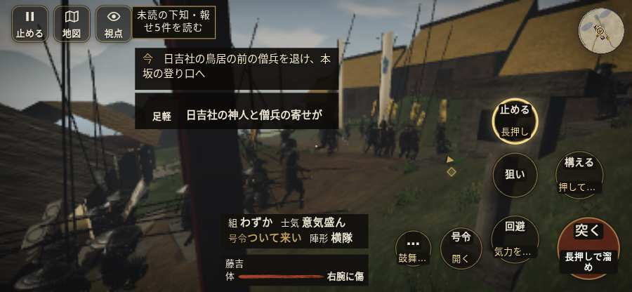

# テストプレイヤーの感想：せっかちな社会人

- 人：ユウキ（35歳・昼休みに遊ぶ会社員）（7164番）
- 変わり目：台詞を全部読む・iPhone 横 844×390・織田家編の戦を一つ・速い・身分 少し上・問屋:刀・槍・具足・一人称・感度 ふつう・止めない
- 時：2026/10/6 15:32:28（302秒かかった）
- 画面：iPhone の横向き 844×390・倍率3・指で触る操作（touch.js の釦・棒・なぞり）・画質 低
- 遊んだ戦：比叡山攻め（試験の持ち時間で打ち切り）（失敗）
- 機械の混み具合：3（load average）

## ひとこと

> 昼休みに2分ほど。比叡山攻め（試験の持ち時間で打ち切り）。前へ進もうとしても進めない所があった。待ってられない。HUD の札どうしが重なって読めない。ここで閉じる人は多いと思う。結局、何分遊べば一区切りなのかが分からない。

## 見つけた問題（2件・困った順）

### 1. 前へ進もうとしても進めない所があった
- どこで：比叡山攻め・36秒・climb
- 何が：(148, -2)・段 climb
- どれくらい困ったか：★★ かなり困った（3回）
- 直し方の目安：当たり（柵・建物・地形）と道のつながりを見直す
- 画面：

### 2. HUD の札どうしが重なって読めない
- どこで：比叡山攻め・20秒・climb
- 何が：#mobfx と .bl（844×390）／#mobfx と #minimap（844×390）
- どれくらい困ったか：★ 少し気になった（6回）
- 直し方の目安：置き場所をずらすか、片方を出している間はもう片方を隠す
- 画面：（その戦の山場の一枚）

## 遊んだ記録

- 比叡山攻め（試験の持ち時間で打ち切り）（戦の任務とは別に、試験全体の持ち時間が尽きた）：120秒・任務失敗・戦功0・組20/20・討ち取り0・突き0/当たり0・号令0回・指で押した数6・読み込み3.6秒・戦の前の札204字・1コマ104.1ms（実時間265秒・内訳 brain 3.4・pad 0.1・tf 0.3・upd 100.1・eye 0.1）
  - 任務の流れ：0s 明智光秀のもとで、坂本から山へ登れ → 12s 日吉社の鳥居の前の僧兵を退け、本坂の登り口へ
  - 味方の隊：隊7・動いた計234m・味方の討ち取り6・敵を前に20秒止まった6回・本物の味方5人未満0秒
  - 受けた傷：足軽 1
  - 開戦：
  - 終わり近く：
