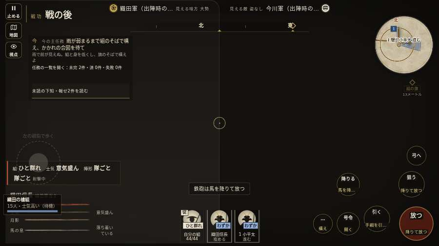

# テストプレイヤーの感想：はじめての中学生

- 人：ハルト（13歳・中学一年）（7215番）
- 変わり目：構え多め・パソコン 1280×720・信長で出陣・ゆっくり・足軽から・問屋:馬・一人称・感度 鈍い・途中で止める
- 時：2026/10/6 15:37:53（313秒かかった）
- 画面：パソコン 1280×720・鍵盤とマウス・画質 低
- 遊んだ戦：桶狭間の戦い（信長で出陣）（試験の持ち時間で打ち切り）（失敗）
- 機械の混み具合：3（load average）

## ひとこと

> 友だちにすすめられて、やってみた。桶狭間（信長で出陣）（試験の持ち時間で打ち切り）をやった。よく分かんないまま終わった。「字が枠から切れている」のとこ、だるい。「前へ進もうとしても進めない所があった」のとこ、マジで意味わかんない。「「親指の棒（歩く）」を押そうとしたら、別の物に当たった」のとこ、マジで意味わかんない。ぶっちゃけ、ここで一回やめかけた。

## 見つけた問題（3件・困った順）

### 1. 字が枠から切れている
- どこで：桶狭間の戦い（信長で出陣）・5秒・brief
- 何が：.side.a > .nm > .n「織田軍（出陣時の目安）」／.side.b > .nm > .n「今川軍（出陣時の目安）」
- どれくらい困ったか：★★★ やめたくなった（71回）
- 直し方の目安：枠を広げるか、字を折り返す
- 画面：（その戦の山場の一枚）

### 2. 前へ進もうとしても進めない所があった
- どこで：桶狭間の戦い（信長で出陣）・33秒・wait
- 何が：(33, -4)・段 wait
- どれくらい困ったか：★★ かなり困った（1回）
- 直し方の目安：当たり（柵・建物・地形）と道のつながりを見直す
- 画面：

### 3. 「親指の棒（歩く）」を押そうとしたら、別の物に当たった
- どこで：桶狭間の戦い（信長で出陣）・53秒・assault
- 何が：指の下にあったのは #battle-notices > #battle-message > #subtitle「使番小地図の1、服部小平太の」
- どれくらい困ったか：★★ かなり困った（1回）
- 直し方の目安：重ねている札の置き場所をずらすか、pointer-events:none にする
- 画面：

## 遊んだ記録

- 桶狭間の戦い（信長で出陣）（試験の持ち時間で打ち切り）（戦の任務とは別に、試験全体の持ち時間が尽きた）：112秒・任務失敗・戦功0・組100/100・討ち取り5・突き18/当たり9・号令0回・指で押した数3925・読み込み5.6秒・戦の前の札133字・1コマ91.2ms（実時間242秒・内訳 brain 0.4・pad 10.8・tf 0.6・upd 79.1・eye 0.3）
  - 任務の流れ：0s 今川の備えへかかれ → 4s 今川の備えへかかれ／組頭の下知を聞き、行軍の合図を待て → 7s 今川の備えへかかれ／すぐ先の組の旗について進め → 30s 今川の備えへかかれ／雨が弱まるまで組のそばで構え、かかれの合図を待て → 39s 味方の旗に続き、道の守りを崩せ
  - 味方の隊：隊6・動いた計622m・味方の討ち取り10・敵を前に20秒止まった1回・本物の味方5人未満0秒
  - 受けた傷：足軽 2
  - 開戦：
