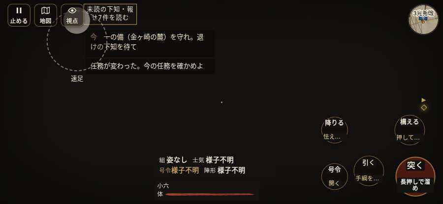

# テストプレイヤーの感想：歴史好きの大人

- 人：ミチオ（62歳・郷土史の会）（7671番）
- 変わり目：構え多め・iPhone 横 932×430・織田家編の戦を一つ・速い・足軽から・問屋:買わない・三人称・感度 鈍い・途中で止める
- 時：2026/10/7 0:49:07（244秒かかった）
- 画面：iPhone の横向き 932×430・倍率3・指で触る操作（touch.js の釦・棒・なぞり）・画質 低
- 遊んだ戦：金ヶ崎の退き口（試験の持ち時間で打ち切り）（失敗）
- 機械の混み具合：4（load average）

## ひとこと

> 金ヶ崎の退き口（試験の持ち時間で打ち切り）を、一人称で歩いて見て回りました。務めは果たせませんでしたが、それより気になる所があります。「親指の棒（歩く）」を押そうとしたら、別の物に当たった。細かい事ですが、こういう所で嘘っぽくなる。味方が味方を傷つけている。当時の人が見たら首を傾げるでしょう。

## 見つけた問題（2件・困った順）

### 1. 味方が味方を傷つけている
- どこで：金ヶ崎の退き口・74秒・l1
- 何が：敵の弓：敵の弓 → 敵の足軽（6）／敵の弓：敵の弓 → 敵の足軽（8）
- どれくらい困ったか：★★ かなり困った（2回）
- 直し方の目安：狙いの相手を選ぶときに、同じ側を外す
- 画面：（その戦の山場の一枚）

### 2. 「親指の棒（歩く）」を押そうとしたら、別の物に当たった
- どこで：金ヶ崎の退き口・37秒・l1
- 何が：指の下にあったのは #battle-notices > #battle-message > #subtitle「足軽来たぞ！　三つ盛木瓜の旗」
- どれくらい困ったか：★★ かなり困った（1回）
- 直し方の目安：重ねている札の置き場所をずらすか、pointer-events:none にする
- 画面：

## 遊んだ記録

- 金ヶ崎の退き口（試験の持ち時間で打ち切り）（戦の任務とは別に、試験全体の持ち時間が尽きた）：104秒・任務失敗・戦功0・組18/36・討ち取り0・突き4/当たり4・号令0回・指で押した数18・読み込み3.6秒・戦の前の札205字・1コマ83.3ms（実時間203秒・内訳 brain 1.2・pad 0.2・tf 0.4・upd 80.9・eye 0.5）
  - 任務の流れ：0s しんがりの一手を預かり、朝倉勢を止めて主力を退かせよ → 37s しんがりの一手を預かり、朝倉勢を止めて主力を退かせよ／一の備（金ヶ崎の麓）を守れ。退けの下知を待て → 102s 味方と次の持ち場へ退け。追手と戦い続けるな
  - 味方の隊：隊10・動いた計199m・味方の討ち取り12・敵を前に20秒止まった15回・本物の味方5人未満0秒
  - 受けた傷：足軽 101
  - 開戦：
  - 山場：
