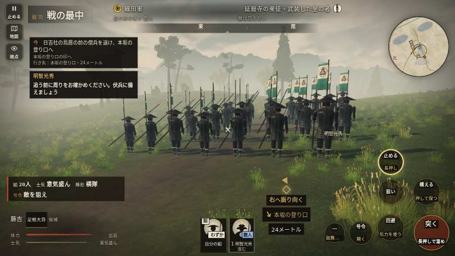

# テストプレイヤーの感想：歴史好きの大人

- 人：ミチオ（62歳・郷土史の会）（7926番）
- 変わり目：構え多め・パソコン 1280×720・織田家編の戦を一つ・ふつう・身分 少し上・問屋:買わない・一人称・感度 鈍い・途中で止める
- 時：2026/10/7 14:59:26（306秒かかった）
- 画面：パソコン 1280×720・鍵盤とマウス・画質 低
- 遊んだ戦：比叡山攻め（試験の持ち時間で打ち切り）（失敗）
- 機械の混み具合：4（load average）

## ひとこと

> 比叡山攻め（試験の持ち時間で打ち切り）を、一人称で歩いて見て回りました。務めは果たせませんでしたが、それより気になる所があります。前へ進もうとしても進めない所があった。史実を知る者としては、ここは看過できません。「親指の棒（歩く）」を押そうとしたら、別の物に当たった。当時の人が見たら首を傾げるでしょう。行き先があるのに20秒動かない兵。史実を知る者としては、ここは看過できません。

## 見つけた問題（3件・困った順）

### 1. 前へ進もうとしても進めない所があった
- どこで：比叡山攻め・36秒・climb
- 何が：(148, 1)・段 climb
- どれくらい困ったか：★★ かなり困った（1回）
- 直し方の目安：当たり（柵・建物・地形）と道のつながりを見直す
- 画面：

### 2. 「親指の棒（歩く）」を押そうとしたら、別の物に当たった
- どこで：比叡山攻め・62秒・climb
- 何が：指の下にあったのは #battle-notices > #battle-message > #subtitle「組頭煙の上がる本坂を、手向か」
- どれくらい困ったか：★★ かなり困った（1回）
- 直し方の目安：重ねている札の置き場所をずらすか、pointer-events:none にする
- 画面：（その戦の山場の一枚）

### 3. 行き先があるのに20秒動かない兵
- どこで：比叡山攻め・165秒・climb
- 何が：味方の半蔵：味方の半蔵（号令：follow・名なし・頭：無/―・近い敵27m）at (84,0)
- どれくらい困ったか：★ 少し気になった（1回）
- 直し方の目安：道が塞がれていないか、行き先に着いたと見なせているかを見る
- 画面：（その戦の山場の一枚）

## 遊んだ記録

- 比叡山攻め（試験の持ち時間で打ち切り）（戦の任務とは別に、試験全体の持ち時間が尽きた）：354秒・任務失敗・戦功25・組15/20・討ち取り6・突き20/当たり20・号令0回・指で押した数40・読み込み9.3秒・戦の前の札158字・1コマ29.5ms（実時間246秒・内訳 brain 0.3・pad 0.1・tf 0.6・upd 28.2・eye 0.2）
  - 任務の流れ：0s 明智光秀のもとで、坂本から山へ登れ → 12s 日吉社の鳥居の前の僧兵を退け、本坂の登り口へ → 57s 煙の上がる本坂を、手向かう者を退けながら登れ → 277s 文殊楼を抜け、燃える堂の間の山道へ進め → 317s 燃える根本中堂の前を抜け、山道を西塔へ掃討せよ
  - 味方の隊：隊11・動いた計1830m・味方の討ち取り36・敵を前に20秒止まった3回・本物の味方5人未満0秒
  - 受けた傷：侍 34・弓 9・足軽 2
  - 開戦：
  - 一人称で見回す（45秒）：
