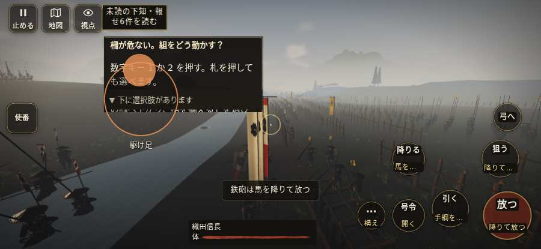

# テストプレイヤーの感想：歴史好きの大人

- 人：ミチオ（62歳・郷土史の会）（7946番）
- 変わり目：構え多め・iPhone 横 932×430・信長で出陣・ふつう・足軽から・問屋:刀・槍・具足・一人称・感度 ふつう・止めない
- 時：2026/10/7 14:57:30（304秒かかった）
- 画面：iPhone の横向き 932×430・倍率3・指で触る操作（touch.js の釦・棒・なぞり）・画質 低
- 遊んだ戦：設楽原の決戦（信長で出陣）（達成）
- 機械の混み具合：3（load average）

## ひとこと

> 設楽原（信長で出陣）を、一人称で歩いて見て回りました。務めは果たせましたが、気になる所がいくつか。兵が一息で飛んだ。細かい事ですが、こういう所で嘘っぽくなる。名のある武将なのに、顔も装束も並の侍と同じ。これでは興が醒めます。敵が近いのに、まわりの兵の多くが棒立ち。細かい事ですが、こういう所で嘘っぽくなる。

## 見つけた問題（8件・困った順）

### 1. 兵が一息で飛んだ（6m 超）
- どこで：設楽原の決戦（信長で出陣）・154秒・redeploy
- 何が：味方の仙石秀久：味方の仙石秀久：(-10,-280) → (-27,22)／敵の内藤昌豊：敵の内藤昌豊：(113,-30) → (39,20)
- どれくらい困ったか：★★★ やめたくなった（130回）
- 直し方の目安：位置を直接書き換えている所を探す（出し直し・押し出し）
- 画面：（その戦の山場の一枚）

### 2. 敵が近いのに、まわりの兵の多くが棒立ち
- どこで：設楽原の決戦（信長で出陣）・360秒・pursuit
- 何が：360秒：まわり35mの12人のうち5人が止まったまま（段 pursuit）
- どれくらい困ったか：★★ かなり困った（2回）
- 直し方の目安：敵が30m内に入ったら、構える・にじり寄る・槍を揃えるなど体を動かす
- 画面：（その戦の山場の一枚）

### 3. 「親指の棒（歩く）」を押そうとしたら、別の物に当たった
- どこで：設楽原の決戦（信長で出陣）・52秒・defend
- 何が：指の下にあったのは #battle-notices > #battle-message > #subtitle「使番小地図の7は仙石秀久の隊」
- どれくらい困ったか：★★ かなり困った（1回）
- 直し方の目安：重ねている札の置き場所をずらすか、pointer-events:none にする
- 画面：（その戦の山場の一枚）

### 4. 名のある武将なのに、顔も装束も並の侍と同じ
- どこで：設楽原の決戦（信長で出陣）・100秒・defend
- 何が：仙石秀久（味方）
- どれくらい困ったか：★ 少し気になった（34回）
- 直し方の目安：units.js の GENERALS に顔・甲冑・兜を足す
- 画面：（その戦の山場の一枚）

### 5. 名のある武将なのに、顔も装束も並の侍と同じ
- どこで：設楽原の決戦（信長で出陣）・25秒・defend
- 何が：真田昌輝（敵）
- どれくらい困ったか：★ 少し気になった（15回）
- 直し方の目安：units.js の GENERALS に顔・甲冑・兜を足す
- 画面：（その戦の山場の一枚）

### 6. 戦う兵が遠景の大軍（影の兵）の中に埋もれている
- どこで：設楽原の決戦（信長で出陣）・6秒・brief
- 何が：味方の兵 4人が、遠景の大軍 #1（中心 -15,-99・1300人）の中（-31, -76）
- どれくらい困ったか：★ 少し気になった（1回）
- 直し方の目安：遠景の大軍を戦う場所から離す（addDistantArmy の x,z,w,d を見直す）か、兵の行き先を大軍の外にする
- 画面：（その戦の山場の一枚）

### 7. 自分が遠景の大軍（影の兵）の中に立っている
- どこで：設楽原の決戦（信長で出陣）・21秒・redeploy
- 何が：味方の兵 1人が、遠景の大軍 #1（中心 -16,-96・1335人）の中（-7, -253）
- どれくらい困ったか：★ 少し気になった（1回）
- 直し方の目安：遠景の大軍を戦う場所から離す（addDistantArmy の x,z,w,d を見直す）か、兵の行き先を大軍の外にする
- 画面：（その戦の山場の一枚）

### 8. 自分のすぐそばの敵が6秒以上なにもしない
- どこで：設楽原の決戦（信長で出陣）・138秒・defend
- 何が：敵の足軽：敵の足軽
- どれくらい困ったか：★ 少し気になった（1回）
- 直し方の目安：近くの敵（遊び手）を狙いに入れる
- 画面：（その戦の山場の一枚）

## 遊んだ記録

- 設楽原の決戦（信長で出陣）：368秒・任務達成・戦功115・組100/100・討ち取り5・突き12/当たり11・号令0回・指で押した数41・読み込み3.7秒・戦の前の札112字・1コマ31.8ms（実時間260秒・内訳 brain 0.3・pad 0.2・tf 0.6・upd 30.6・eye 0.2）
  - 任務の流れ：0s 柵を守れ。奥の柵を三十秒占められると負ける → 12s 大宮前の印へ歩き、仙石と北の柵を守れ → 24s 真田の寄せを受け、仙石の柵を槍で守れ → 128s 柵のまわりで槍を揃え、入った敵を押し返せ → 154s 柳田前で組を揃え、中央の寄せを受けよ → 154s 内側の柵へ下がり、中央の突破を止めよ → 193s 柵前の敵を撃ち、突破を止めよ → 214s 組を集め、追い討ち時を待て → 217s 下知じゃ。大宮前の虎口から出て、退く武田勢を追え → 368s 下知じゃ。大宮前の虎口から出て、退く武田勢を追え〔失〕
  - 味方の隊：隊26・動いた計2954m・味方の討ち取り13・敵を前に20秒止まった54回・本物の味方5人未満0秒
  - 受けた傷：侍 23・足軽 19
  - 開戦：
  - 山場：
  - 一人称で見回す（46秒）：
