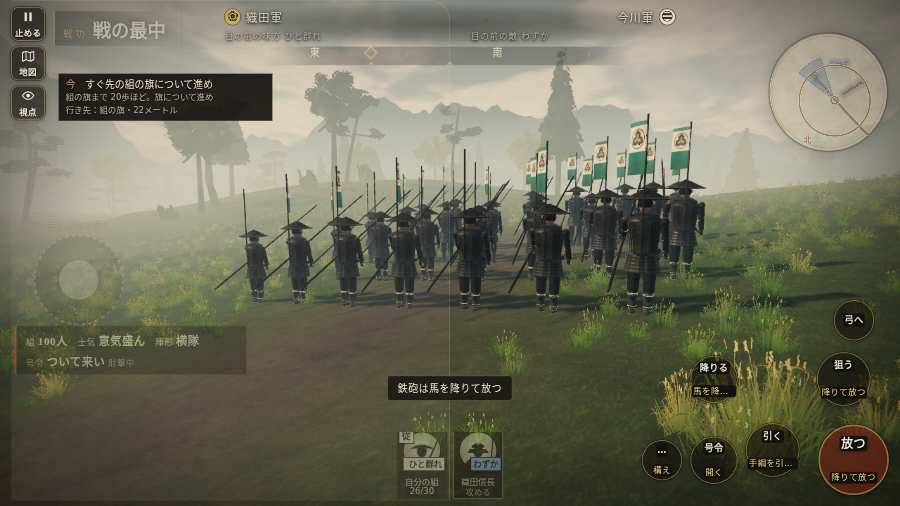

# テストプレイヤーの感想：はじめての中学生

- 人：ハルト（13歳・中学一年）（8075番）
- 変わり目：連打・パソコン 1280×720・信長で出陣・ふつう・身分 上・問屋:鉄砲・一人称・感度 ふつう・止めない
- 時：2026/10/7 14:46:15（301秒かかった）
- 画面：パソコン 1280×720・鍵盤とマウス・画質 低
- 遊んだ戦：桶狭間の戦い（信長で出陣）（試験の持ち時間で打ち切り）（失敗）
- 機械の混み具合：2（load average）

## ひとこと

> えっと、遊んでみた。桶狭間（信長で出陣）（試験の持ち時間で打ち切り）をやった。よく分かんないまま終わった。「字が枠から切れている」のとこ、だるい。「前へ進もうとしても進めない所があった」のとこ、ムリ。「押せる所が小さい」のとこ、だるい。ぶっちゃけ、ここで一回やめかけた。

## 見つけた問題（3件・困った順）

### 1. 字が枠から切れている
- どこで：桶狭間の戦い（信長で出陣）・開戦
- 何が：#h-units > .uc.ally > .nm「織田信長」／#h-units > .uc.ally > .nm「1 小平太」
- どれくらい困ったか：★★★ やめたくなった（30回）
- 直し方の目安：枠を広げるか、字を折り返す
- 画面：（その戦の山場の一枚）

### 2. 前へ進もうとしても進めない所があった
- どこで：桶狭間の戦い（信長で出陣）・34秒・march
- 何が：(26, -11)・段 march
- どれくらい困ったか：★★ かなり困った（2回）
- 直し方の目安：当たり（柵・建物・地形）と道のつながりを見直す
- 画面：

### 3. 押せる所が小さい（28px 未満）
- どこで：桶狭間の戦い（信長で出陣）・開戦
- 何が：#battle-notices > #objectives.goal-changed > #obj-list：284×20「「今」の任務を進めよう。」
- どれくらい困ったか：★★ かなり困った（2回）
- 直し方の目安：押せる大きさを 28px 以上に
- 画面：（その戦の山場の一枚）

## 遊んだ記録

- 桶狭間の戦い（信長で出陣）（試験の持ち時間で打ち切り）（戦の任務とは別に、試験全体の持ち時間が尽きた）：117秒・任務失敗・戦功0・組100/100・討ち取り0・突き0/当たり0・号令0回・指で押した数27804・読み込み2.5秒・戦の前の札133字・1コマ95.5ms（実時間262秒・内訳 brain 0.3・pad 66.4・tf 0.5・upd 28.2・eye 0.1）
  - 任務の流れ：0s 今川の備えへかかれ → 4s 今川の備えへかかれ／組頭の下知を聞き、行軍の合図を待て → 7s 今川の備えへかかれ／すぐ先の組の旗について進め → 48s 今川の備えへかかれ／雨が弱まるまで組のそばで構え、かかれの合図を待て → 57s 味方の旗に続き、道の守りを崩せ
  - 味方の隊：隊6・動いた計543m・味方の討ち取り22・敵を前に20秒止まった5回・本物の味方5人未満0秒
  - 開戦：
  - 山場：
