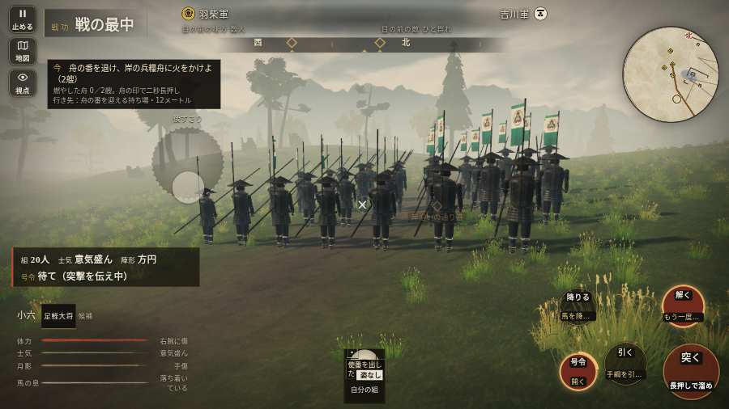

# テストプレイヤーの感想：指揮好きの戦略家

- 人：ケイコ（45歳・将棋と戦略ゲーム好き）（8183番）
- 変わり目：迷子になりやすい・パソコン 1280×720・織田家編の戦を一つ・ふつう・身分 上・問屋:鉄砲・一人称・感度 敏感・止めない
- 時：2026/10/7 20:48:57（126秒かかった）
- 画面：パソコン 1280×720・鍵盤とマウス・画質 低
- 遊んだ戦：鳥取城の戦い（失敗・倒れた）
- 機械の混み具合：4（load average）

## ひとこと

> 鳥取城で、号令を14回かけました。号令「突撃」から3秒たっても、組の7割が動かない。采配の上で、これは痛い。号令「陣形」が、指の号令の輪から出せない。指揮官としてはもどかしい。号令の輪で選んだのに、号令が出なかった。指揮官としてはもどかしい。采配で負けたのか、操作で負けたのか分からないのが一番困ります。

## 見つけた問題（8件・困った順）

### 1. 号令「陣形」が、指の号令の輪から出せない
- どこで：鳥取城の戦い・2秒・boats
- 何が：号令の輪（RADIAL）に無い、または身分が足りず選べない（鳥取城の戦い・2秒・boats）
- どれくらい困ったか：★★★ やめたくなった（1回）
- 直し方の目安：号令の輪に足すか、短く押した時の指揮の札（数字の号令）を指で押せるようにする
- 画面：（その戦の山場の一枚）

### 2. 号令の輪で選んだのに、号令が出なかった
- どこで：鳥取城の戦い・176秒・sortie
- 何が：「focus」を選んで放した（鳥取城の戦い・176秒・sortie）
- どれくらい困ったか：★★★ やめたくなった（1回）
- 直し方の目安：touch.js の号令の丸の滑らせ方と player.js の radialSel を見直す
- 画面：（その戦の山場の一枚）

### 3. 号令「突撃」から3秒たっても、組の7割が動かない
- どこで：鳥取城の戦い・20秒・boats
- 何が：20人のうち動いたのは0人（鳥取城の戦い・20秒・boats）
- どれくらい困ったか：★★ かなり困った（12回）
- 直し方の目安：号令を受けた兵がすぐ向きを変えて動き出すようにする（行き先・狙いの付け直し）
- 画面：

### 4. HUD の札どうしが重なって読めない
- どこで：鳥取城の戦い・175秒・sortie
- 何が：#brinkfx と .plaque（1280×720）／#brinkfx と .bl（1280×720）
- どれくらい困ったか：★★ かなり困った（9回）
- 直し方の目安：置き場所をずらすか、片方を出している間はもう片方を隠す
- 画面：（その戦の山場の一枚）

### 5. 押せる所が小さい（28px 未満）
- どこで：鳥取城の戦い・開戦
- 何が：#battle-notices > #objectives > #obj-list：284×20「「今」の任務を進めよう。」／.ek-in > .note > .word-help：26×44「足軽」
- どれくらい困ったか：★ 少し気になった（5回）
- 直し方の目安：押せる大きさを 28px 以上に
- 画面：（その戦の山場の一枚）

### 6. 倒れて戦が終わった
- どこで：鳥取城の戦い・190秒・sortie
- 何が：175秒で倒れた（受けた傷：足軽 99・侍 20）
- どれくらい困ったか：★ 少し気になった（1回）
- 直し方の目安：初めの戦は受ける傷を減らす・危ない時に字幕で構えを教える
- 画面：（その戦の山場の一枚）

### 7. 戦場が札に食われている（画面の3分の1超）
- どこで：鳥取城の戦い・175秒・sortie
- 何が：1280×720 で 100%
- どれくらい困ったか：★ 少し気になった（1回）
- 直し方の目安：札を小さくするか、平時は薄く・畳む
- 画面：（その戦の山場の一枚）

### 8. 押せる所どうしが重なっている
- どこで：鳥取城の戦い・戦のあと
- 何が：「足軽」と「戦功」
- どれくらい困ったか：★ 少し気になった（1回）
- 直し方の目安：間を空ける
- 画面：（その戦の山場の一枚）

## 遊んだ記録

- 鳥取城の戦い：175秒・任務失敗（倒れた）・戦功75・組20/20・討ち取り2・突き4/当たり4・号令14回・指で押した数243・読み込み2.8秒・戦の前の札178字・1コマ17.7ms（実時間91秒・内訳 brain 0.1・pad 0.3・tf 0.3・upd 16.7・eye 0.1）
  - 任務の流れ：0s 川岸の組の印へ進み、一手をそろえよ → 2s 舟の番を退け、岸の兵糧舟に火をかけよ（2艘） → 101s 預かった柵の一手で、打って出た城兵を止めよ
  - 味方の隊：隊19・動いた計1281m・味方の討ち取り27・敵を前に20秒止まった26回・本物の味方5人未満0秒
  - 受けた傷：足軽 99・侍 20
  - 開戦：
  - 山場：
