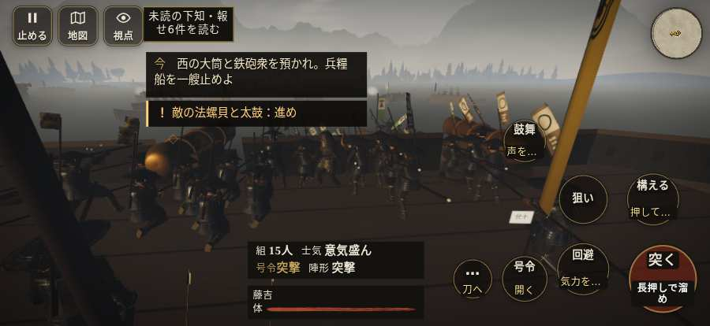

# テストプレイヤーの感想：指揮好きの戦略家

- 人：ケイコ（45歳・将棋と戦略ゲーム好き）（8193番）
- 変わり目：迷子になりやすい・iPhone 横 874×402・新しく始める通し・ゆっくり・身分 上・問屋:鉄砲・一人称・感度 鈍い・止めない
- 時：2026/10/7 20:51:36（180秒かかった）
- 画面：iPhone の横向き 874×402・倍率3・指で触る操作（touch.js の釦・棒・なぞり）・画質 低
- 遊んだ戦：第二次木津川口の戦い（失敗・倒れた）
- 機械の混み具合：3（load average）

## ひとこと

> 第二次木津川口で、号令を8回かけました。兵が戦場の外に出た。ここが直れば、ぐっと指揮が楽しくなる。号令「陣形」が、指の号令の輪から出せない。命令が信用できないと、策が立てられません。行き先があるのに20秒動かない兵。指揮官としてはもどかしい。采配で負けたのか、操作で負けたのか分からないのが一番困ります。

## 見つけた問題（10件・困った順）

### 1. 兵が戦場の外に出た
- どこで：第二次木津川口の戦い・135秒・fire
- 何が：敵の足軽：敵の足軽：(177,-28)／敵の足軽：敵の足軽：(177,-30)
- どれくらい困ったか：★★★ やめたくなった（7940回）
- 直し方の目安：行き先を戦場の内側に収める
- 画面：（その戦の山場の一枚）

### 2. 行き先があるのに20秒動かない兵
- どこで：第二次木津川口の戦い・219秒・end
- 何が：敵の足軽：敵の足軽（号令：attack・舟の毛利勢・頭：fine/―・近い敵47m）at (-45,-27)／敵の足軽：敵の足軽（号令：attack・舟の毛利勢・頭：fine/―・近い敵47m）at (-45,-29)
- どれくらい困ったか：★★★ やめたくなった（8回）
- 直し方の目安：道が塞がれていないか、行き先に着いたと見なせているかを見る
- 画面：（その戦の山場の一枚）

### 3. 号令「陣形」が、指の号令の輪から出せない
- どこで：第二次木津川口の戦い・12秒・brief
- 何が：号令の輪（RADIAL）に無い、または身分が足りず選べない（第二次木津川口の戦い・12秒・brief）
- どれくらい困ったか：★★★ やめたくなった（1回）
- 直し方の目安：号令の輪に足すか、短く押した時の指揮の札（数字の号令）を指で押せるようにする
- 画面：（その戦の山場の一枚）

### 4. 兵が一息で飛んだ（6m 超）
- どこで：第二次木津川口の戦い・185秒・end
- 何が：敵の足軽：敵の足軽：(333,-34) → (176,-34)／敵の足軽：敵の足軽：(333,-36) → (176,-36)
- どれくらい困ったか：★★ かなり困った（8回）
- 直し方の目安：位置を直接書き換えている所を探す（出し直し・押し出し）
- 画面：（その戦の山場の一枚）

### 5. HUD の札どうしが重なって読めない
- どこで：第二次木津川口の戦い・195秒・end
- 何が：#mobfx と .bl（874×402）／#mobfx と #minimap（874×402）
- どれくらい困ったか：★★ かなり困った（6回）
- 直し方の目安：置き場所をずらすか、片方を出している間はもう片方を隠す
- 画面：（その戦の山場の一枚）

### 6. 「親指の棒（歩く）」を押そうとしたら、別の物に当たった
- どこで：第二次木津川口の戦い・28秒・cannon
- 何が：指の下にあったのは #battle-message > #subtitle > span「西の大筒と鉄砲衆を預かれ。兵」
- どれくらい困ったか：★★ かなり困った（1回）
- 直し方の目安：重ねている札の置き場所をずらすか、pointer-events:none にする
- 画面：

### 7. 同じ知らせが20秒に4回以上
- どこで：第二次木津川口の戦い・121秒・fire
- 何が：「水桶を取り、甲板の火を消せ。水桶の印を見よ。」（台詞）
- どれくらい困ったか：★ 少し気になった（3回）
- 直し方の目安：一度出したら、しばらく同じ物を出さない
- 画面：（その戦の山場の一枚）

### 8. 押せる所が小さい（28px 未満）
- どこで：第二次木津川口の戦い・戦のあと
- 何が：.ek-in > .note > .word-help：26×44「戦功」／.ek-c > b > .word-help：26×47「知行」
- どれくらい困ったか：★ 少し気になった（3回）
- 直し方の目安：押せる大きさを 28px 以上に
- 画面：（その戦の山場の一枚）

### 9. 倒れて戦が終わった
- どこで：第二次木津川口の戦い・232秒・end
- 何が：185秒で倒れた（受けた傷：足軽 111・弓 1）
- どれくらい困ったか：★ 少し気になった（1回）
- 直し方の目安：初めの戦は受ける傷を減らす・危ない時に字幕で構えを教える
- 画面：（その戦の山場の一枚）

### 10. 戦場が札に食われている（画面の3分の1超）
- どこで：第二次木津川口の戦い・195秒・end
- 何が：874×402 で 100%
- どれくらい困ったか：★ 少し気になった（1回）
- 直し方の目安：札を小さくするか、平時は薄く・畳む
- 画面：（その戦の山場の一枚）

## 遊んだ記録

- 第二次木津川口の戦い：185秒・任務失敗（倒れた）・戦功58・組9/15・討ち取り4・突き16/当たり13・号令8回・指で押した数820・読み込み4.5秒・戦の前の札147字・1コマ26.4ms（実時間143秒・内訳 brain 0.1・pad 0.9・tf 0.5・upd 24.9・eye 0.1）
  - 任務の流れ：0s 西の大筒へ。鉄砲衆を預かれ → 24s 西の大筒と鉄砲衆を預かれ。兵糧船を一艘止めよ → 110s 水桶を取り、甲板の火を消せ → 185s 水桶を取り、甲板の火を消せ〔失〕
  - 味方の隊：隊12・動いた計313m・味方の討ち取り66・敵を前に20秒止まった9回・本物の味方5人未満0秒
  - 受けた傷：足軽 111・弓 1
  - 開戦：
  - 山場：
