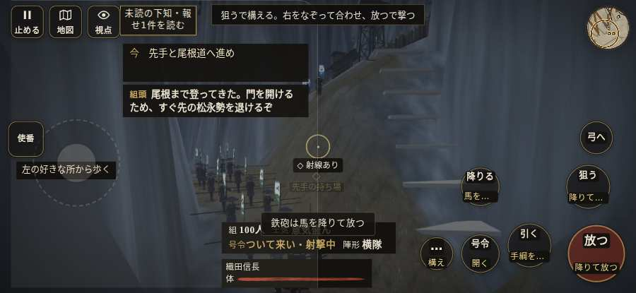

# テストプレイヤーの感想：せっかちな社会人

- 人：ユウキ（35歳・昼休みに遊ぶ会社員）（8219番）
- 変わり目：台詞を全部読む・iPhone 横 932×430・信長で出陣・ふつう・身分 上・問屋:鉄砲・三人称・感度 敏感・途中で止める
- 時：2026/10/7 21:13:36（257秒かかった）
- 画面：iPhone の横向き 932×430・倍率3・指で触る操作（touch.js の釦・棒・なぞり）・画質 低
- 遊んだ戦：信貴山城の戦い（信長で出陣）（失敗）
- 機械の混み具合：3（load average）

## ひとこと

> 昼休みに8分ほど。信貴山城（信長で出陣）。前へ進もうとしても進めない所があった。待ってられない。「親指の棒（歩く）」を押そうとしたら、別の物に当たった。時間がもったいない。一つの戦が長い。正直、飛ばしたい。結局、何分遊べば一区切りなのかが分からない。

## 見つけた問題（7件・困った順）

### 1. 前へ進もうとしても進めない所があった
- どこで：信貴山城の戦い（信長で出陣）・33秒・climb
- 何が：(17, -52)・段 climb
- どれくらい困ったか：★★ かなり困った（12回）
- 直し方の目安：当たり（柵・建物・地形）と道のつながりを見直す
- 画面：

### 2. 「親指の棒（歩く）」を押そうとしたら、別の物に当たった
- どこで：信貴山城の戦い（信長で出陣）・8秒・climb
- 何が：指の下にあったのは #battle-notices > #battle-message > #subtitle「近習尾根の松永勢を退け、門の」
- どれくらい困ったか：★★ かなり困った（1回）
- 直し方の目安：重ねている札の置き場所をずらすか、pointer-events:none にする
- 画面：

### 3. 行き先があるのに20秒動かない兵
- どこで：信貴山城の戦い（信長で出陣）・516秒・end
- 何が：味方の鉄砲：味方の鉄砲（号令：retreat・名なし・頭：無/―・近い敵2m）at (25,-63)／味方の鉄砲：味方の鉄砲（号令：retreat・名なし・頭：無/―・近い敵18m）at (8,-65)
- どれくらい困ったか：★ 少し気になった（12回）
- 直し方の目安：道が塞がれていないか、行き先に着いたと見なせているかを見る
- 画面：（その戦の山場の一枚）

### 4. HUD の札どうしが重なって読めない
- どこで：信貴山城の戦い（信長で出陣）・35秒・climb
- 何が：#aimwarn と .mk.quiet（932×430）／#aimwarn と .bl（932×430）
- どれくらい困ったか：★ 少し気になった（7回）
- 直し方の目安：置き場所をずらすか、片方を出している間はもう片方を隠す
- 画面：（その戦の山場の一枚）

### 5. 押せる所が小さい（28px 未満）
- どこで：信貴山城の戦い（信長で出陣）・戦のあと
- 何が：.ek-in > .note > .word-help：26×44「戦功」／.ek-c > b > .word-help：26×47「知行」
- どれくらい困ったか：★ 少し気になった（4回）
- 直し方の目安：押せる大きさを 28px 以上に
- 画面：（その戦の山場の一枚）

### 6. 遊び手を責める言い回し
- どこで：信貴山城の戦い（信長で出陣）・65秒・climb
- 何が：「味方「しっかりせい……！　まだ死ぬな！」」（報せ）
- どれくらい困ったか：★ 少し気になった（3回）
- 直し方の目安：責めずに、次にどうすればよいかを言う
- 画面：（その戦の山場の一枚）

### 7. 一つの戦が長い（7分を超えた）
- どこで：信貴山城の戦い（信長で出陣）・542秒・end
- 何が：信貴山城の戦い（信長で出陣）：8分
- どれくらい困ったか：★ 少し気になった（1回）
- 直し方の目安：途中で区切れる所（段の切れ目）に「ここまで」を置く
- 画面：（その戦の山場の一枚）

## 遊んだ記録

- 信貴山城の戦い（信長で出陣）：463秒・任務失敗・戦功15・組46/100・討ち取り0・突き0/当たり0・号令0回・指で押した数10・読み込み2.1秒・戦の前の札105字・1コマ19.6ms（実時間229秒・内訳 brain 0.1・pad 0.1・tf 0.3・upd 19.0・eye 0.1）
  - 任務の流れ：0s 先手と尾根道へ進め → 5s 尾根の松永勢を退け、門の前へ進め → 91s 門脇の物見櫓に火を放ち、守りを乱せ → 463s 門脇の物見櫓に火を放ち、守りを乱せ〔失〕
  - 味方の隊：隊7・動いた計325m・味方の討ち取り66・敵を前に20秒止まった21回・本物の味方5人未満5秒
  - 受けた傷：足軽 34・侍 0
  - 開戦：
