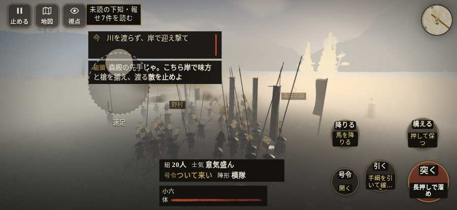

# テストプレイヤーの感想：アクション好き

- 人：ソウタ（24歳・アクションゲーム好き）（8547番）
- 変わり目：連打・iPhone 横 932×430・織田家編の戦を一つ・ゆっくり・身分 少し上・問屋:供・三人称・感度 ふつう・止めない
- 時：2026/10/8 7:51:47（236秒かかった）
- 画面：iPhone の横向き 932×430・倍率3・指で触る操作（touch.js の釦・棒・なぞり）・画質 低
- 遊んだ戦：姉川の戦い（失敗・倒れた）
- 機械の混み具合：4（load average）

## ひとこと

> とにかく突っ込んだ。7分で5人斬った。10回突いて10回当たり。当たりはいい感じ。HUD の札どうしが重なって読めない、ストレスたまる。「親指の棒（歩く）」を押そうとしたら、別の物に当たった、ここは爽快感が死んでる。倒れて戦が終わった、もったいない。1回やられた。難しいのはいいけど、何でやられたか分かるようにしてほしい。

## 見つけた問題（7件・困った順）

### 1. HUD の札どうしが重なって読めない
- どこで：姉川の戦い・175秒・charge
- 何が：#aimwarn と .mk.quiet（932×430）／#aimwarn と .bl（932×430）
- どれくらい困ったか：★★ かなり困った（43回）
- 直し方の目安：置き場所をずらすか、片方を出している間はもう片方を隠す
- 画面：（その戦の山場の一枚）

### 2. 「親指の棒（歩く）」を押そうとしたら、別の物に当たった
- どこで：姉川の戦い・64秒・charge
- 何が：指の下にあったのは #battle-notices > #battle-message > #subtitle「使番森可成殿より。「坂井殿の」
- どれくらい困ったか：★★ かなり困った（1回）
- 直し方の目安：重ねている札の置き場所をずらすか、pointer-events:none にする
- 画面：

### 3. 倒れて戦が終わった
- どこで：姉川の戦い・451秒・counter
- 何が：399秒で倒れた（受けた傷：足軽 65・侍 16・騎馬 8）
- どれくらい困ったか：★★ かなり困った（1回）
- 直し方の目安：初めの戦は受ける傷を減らす・危ない時に字幕で構えを教える
- 画面：（その戦の山場の一枚）

### 4. 戦場が札に食われている（画面の3分の1超）
- どこで：姉川の戦い・175秒・charge
- 何が：932×430 で 100%
- どれくらい困ったか：★ 少し気になった（8回）
- 直し方の目安：札を小さくするか、平時は薄く・畳む
- 画面：（その戦の山場の一枚）

### 5. 押せる所が小さい（28px 未満）
- どこで：姉川の戦い・戦のあと
- 何が：.ek-in > .note > .word-help：26×44「足軽」／.ek-in > .note > .word-help：26×44「戦功」
- どれくらい困ったか：★ 少し気になった（5回）
- 直し方の目安：押せる大きさを 28px 以上に
- 画面：（その戦の山場の一枚）

### 6. 斬り合う相手が少なくて退屈
- どこで：姉川の戦い・451秒・counter
- 何が：7分で5人
- どれくらい困ったか：★ 少し気になった（1回）
- 画面：（その戦の山場の一枚）

### 7. 行き先があるのに20秒動かない兵
- どこで：姉川の戦い・344秒・counter
- 何が：味方の足軽：味方の足軽（号令：attack・森可成の中の段・頭：無/―・近い敵13m）at (-30,118)
- どれくらい困ったか：★ 少し気になった（1回）
- 直し方の目安：道が塞がれていないか、行き先に着いたと見なせているかを見る
- 画面：（その戦の山場の一枚）

## 遊んだ記録

- 姉川の戦い：399秒・任務失敗（倒れた）・戦功50・組5/43・討ち取り5・突き10/当たり10・号令0回・指で押した数46・読み込み1.6秒・戦の前の札147字・1コマ20.2ms（実時間203秒・内訳 brain 0.1・pad 0.1・tf 0.3・upd 19.7・eye 0.1）
  - 任務の流れ：0s 森の備の先手の一手を預かり、浅井の寄せを受け止めよ → 11s こちら岸の先手の印で、次の寄せに備えよ → 29s こちら岸で、寄せる浅井を迎え撃て → 100s こちら岸の先手の印で、次の寄せに備えよ → 105s こちら岸で、寄せる浅井を迎え撃て → 156s こちら岸の先手の印で、次の寄せに備えよ → 161s こちら岸で、寄せる浅井を迎え撃て → 249s こちら岸で、寄せる浅井を迎え撃て〔済〕 → 249s こちら岸で、寄せる浅井を迎え撃て〔済〕／森の備と川を渡り、しんがりを追え → 303s こちら岸で、寄せる浅井を迎え撃て〔済〕／味方の槍の後ろへ下がれ → 399s こちら岸で、寄せる浅井を迎え撃て〔済〕／味方の槍の後ろへ下がれ〔失〕
  - 味方の隊：隊61・動いた計8041m・味方の討ち取り53・敵を前に20秒止まった35回・本物の味方5人未満0秒
  - 受けた傷：足軽 65・侍 16・騎馬 8
  - 開戦：
  - 山場：
