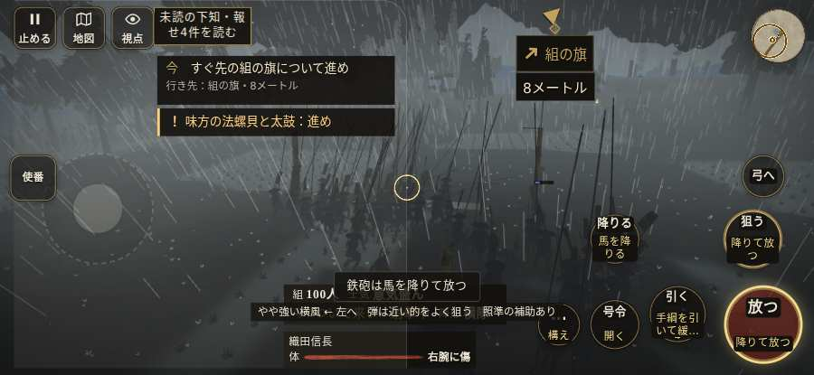

# テストプレイヤーの感想：はじめての中学生

- 人：ハルト（13歳・中学一年）（8670番）
- 変わり目：台詞を全部読む・iPhone 横 932×430・信長で出陣・ふつう・身分 中ほど・問屋:供・三人称・感度 ふつう・途中で止める
- 時：2026/10/8 7:27:40（244秒かかった）
- 画面：iPhone の横向き 932×430・倍率3・指で触る操作（touch.js の釦・棒・なぞり）・画質 低
- 遊んだ戦：桶狭間の戦い（信長で出陣）（試験の持ち時間で打ち切り）（失敗）
- 機械の混み具合：2（load average）

## ひとこと

> えっと、遊んでみた。桶狭間（信長で出陣）（試験の持ち時間で打ち切り）をやった。よく分かんないまま終わった。「前へ進もうとしても進めない所があった」のとこ、マジで意味わかんない。槍でつくのはちょっと楽しい。

## 見つけた問題（1件・困った順）

### 1. 前へ進もうとしても進めない所があった
- どこで：桶狭間の戦い（信長で出陣）・34秒・march
- 何が：(38, -8)・段 march
- どれくらい困ったか：★★ かなり困った（1回）
- 直し方の目安：当たり（柵・建物・地形）と道のつながりを見直す
- 画面：

## 遊んだ記録

- 桶狭間の戦い（信長で出陣）（試験の持ち時間で打ち切り）（戦の任務とは別に、試験全体の持ち時間が尽きた）：137秒・任務失敗・戦功0・組100/100・討ち取り3・突き21/当たり4・号令0回・指で押した数26142・読み込み1.8秒・戦の前の札121字・1コマ66.2ms（実時間205秒・内訳 brain 0.3・pad 33.7・tf 0.8・upd 31.3・eye 0.1）
  - 任務の流れ：0s 今川の備えへかかれ → 7s 今川の備えへかかれ／すぐ先の組の旗について進め → 52s 今川の備えへかかれ／雨が弱まるまで組のそばで構え、かかれの合図を待て → 69s 味方の旗に続き、道の守りを崩せ → 112s 組とともに、義元を囲む旗本を崩せ
  - 味方の隊：隊6・動いた計711m・味方の討ち取り19・敵を前に20秒止まった2回・本物の味方5人未満0秒
  - 受けた傷：足軽 11・弓 8
  - 開戦：
  - 山場：
