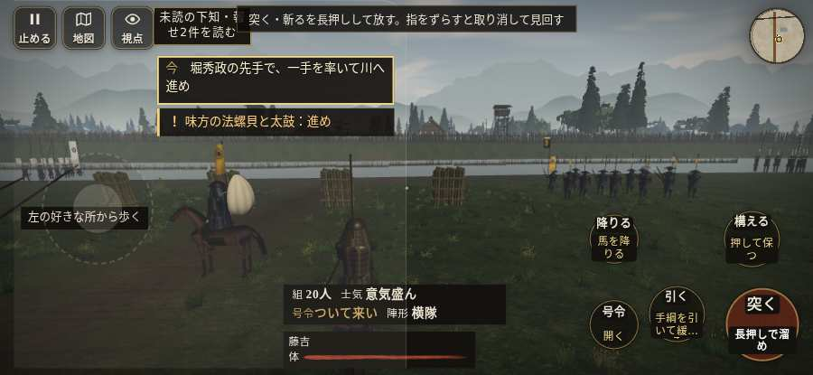

# テストプレイヤーの感想：せっかちな社会人

- 人：ユウキ（35歳・昼休みに遊ぶ会社員）（8679番）
- 変わり目：台詞を全部読む・iPhone 横 932×430・織田家編の戦を一つ・速い・身分 中ほど・問屋:供・一人称・感度 敏感・途中で止める
- 時：2026/10/8 7:57:56（152秒かかった）
- 画面：iPhone の横向き 932×430・倍率3・指で触る操作（touch.js の釦・棒・なぞり）・画質 低
- 遊んだ戦：雑賀攻め・小雑賀川（失敗・倒れた）
- 機械の混み具合：5（load average）

## ひとこと

> 昼休みに3分ほど。雑賀攻め・小雑賀川。「親指の棒（歩く）」を押そうとしたら、別の物に当たった。待ってられない。前へ進もうとしても進めない所があった。時間がもったいない。倒れて戦が終わった。正直、飛ばしたい。結局、何分遊べば一区切りなのかが分からない。

## 見つけた問題（5件・困った順）

### 1. 「親指の棒（歩く）」を押そうとしたら、別の物に当たった
- どこで：雑賀攻め・小雑賀川・5秒・stakes
- 何が：指の下にあったのは #battle-notices > #battle-message > #subtitle「堀秀政西の岸が雑賀の柵じゃ。」
- どれくらい困ったか：★★ かなり困った（1回）
- 直し方の目安：重ねている札の置き場所をずらすか、pointer-events:none にする
- 画面：

### 2. 前へ進もうとしても進めない所があった
- どこで：雑賀攻め・小雑賀川・33秒・stakes
- 何が：(0, 13)・段 stakes
- どれくらい困ったか：★★ かなり困った（1回）
- 直し方の目安：当たり（柵・建物・地形）と道のつながりを見直す
- 画面：

### 3. HUD の札どうしが重なって読めない
- どこで：雑賀攻め・小雑賀川・105秒・stakes
- 何が：#brinkfx と .bl（932×430）／#brinkfx と #minimap（932×430）
- どれくらい困ったか：★ 少し気になった（6回）
- 直し方の目安：置き場所をずらすか、片方を出している間はもう片方を隠す
- 画面：（その戦の山場の一枚）

### 4. 押せる所が小さい（28px 未満）
- どこで：雑賀攻め・小雑賀川・戦のあと
- 何が：.ek-in > .note > .word-help：26×44「足軽」／.ek-in > .note > .word-help：26×44「戦功」
- どれくらい困ったか：★ 少し気になった（4回）
- 直し方の目安：押せる大きさを 28px 以上に
- 画面：（その戦の山場の一枚）

### 5. 倒れて戦が終わった
- どこで：雑賀攻め・小雑賀川・184秒・stakes
- 何が：169秒で倒れた（受けた傷：足軽 80）
- どれくらい困ったか：★ 少し気になった（1回）
- 直し方の目安：初めの戦は受ける傷を減らす・危ない時に字幕で構えを教える
- 画面：（その戦の山場の一枚）

## 遊んだ記録

- 雑賀攻め・小雑賀川：169秒・任務失敗（倒れた）・戦功50・組17/20・討ち取り0・突き0/当たり0・号令0回・指で押した数17・読み込み1.4秒・戦の前の札146字・1コマ26.2ms（実時間125秒・内訳 brain 0.2・pad 0.1・tf 0.4・upd 25.4・eye 0.1）
  - 任務の流れ：0s 堀秀政の先手で、一手を率いて川へ進め → 5s 杭を外す組を守れ。手伝う時は組のそばの印で十二秒押せ
  - 味方の隊：隊23・動いた計3370m・味方の討ち取り33・敵を前に20秒止まった2回・本物の味方5人未満0秒
  - 受けた傷：足軽 80
  - 開戦：
