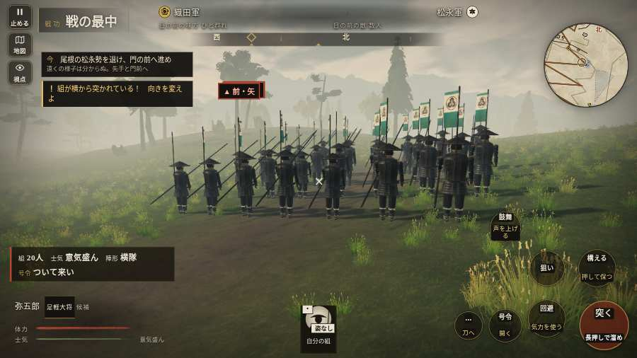

# テストプレイヤーの感想：せっかちな社会人

- 人：ユウキ（35歳・昼休みに遊ぶ会社員）（9019番）
- 変わり目：台詞を全部読む・パソコン 1280×720・新しく始める通し・速い・身分 上・問屋:買わない・一人称・感度 鈍い・止めない
- 時：2026/10/8 22:03:52（308秒かかった）
- 画面：パソコン 1280×720・鍵盤とマウス・画質 低
- 遊んだ戦：信貴山城の戦い（試験の持ち時間で打ち切り）（失敗）
- 機械の混み具合：4（load average）

## ひとこと

> 昼休みに5分ほど。信貴山城（試験の持ち時間で打ち切り）。前へ進もうとしても進めない所があった。ここで閉じる人は多いと思う。戦が始まるまでの読み込みが長い。正直、飛ばしたい。何もする事が無いまま待たされた。時間がもったいない。読み込みも8秒待たされた。結局、何分遊べば一区切りなのかが分からない。

## 見つけた問題（3件・困った順）

### 1. 前へ進もうとしても進めない所があった
- どこで：信貴山城の戦い・34秒・climb
- 何が：(32, -46)・段 climb
- どれくらい困ったか：★★ かなり困った（8回）
- 直し方の目安：当たり（柵・建物・地形）と道のつながりを見直す
- 画面：

### 2. 戦が始まるまでの読み込みが長い
- どこで：信貴山城の戦い
- 何が：信貴山城の戦い：押してから 8.3秒（機械が混んでいる時の値）
- どれくらい困ったか：★★ かなり困った（1回）
- 直し方の目安：読み込みの間に、戦の心得を読ませる／重い物を後から足す
- 画面：（その戦の山場の一枚）

### 3. 何もする事が無いまま待たされた
- どこで：信貴山城の戦い・211秒・climb
- 何が：160秒、任務札が変わらず敵もいない（段 climb）
- どれくらい困ったか：★★ かなり困った（1回）
- 直し方の目安：飛ばせる（canSkip）ようにするか、待つ間にする事を置く
- 画面：（その戦の山場の一枚）

## 遊んだ記録

- 信貴山城の戦い（試験の持ち時間で打ち切り）（戦の任務とは別に、試験全体の持ち時間が尽きた）：307秒・任務失敗・戦功25・組11/20・討ち取り2・突き10/当たり10・号令0回・指で押した数14・読み込み8.3秒・戦の前の札159字・1コマ32.7ms（実時間231秒・内訳 brain 0.2・pad 0.1・tf 0.6・upd 31.5・eye 0.2）
  - 任務の流れ：1s 一手を率い、先手と尾根道へ進め → 5s 尾根の松永勢を退け、門の前へ進め
  - 味方の隊：隊32・動いた計609m・味方の討ち取り24・敵を前に20秒止まった25回・本物の味方5人未満0秒
  - 開戦：
  - 山場：
