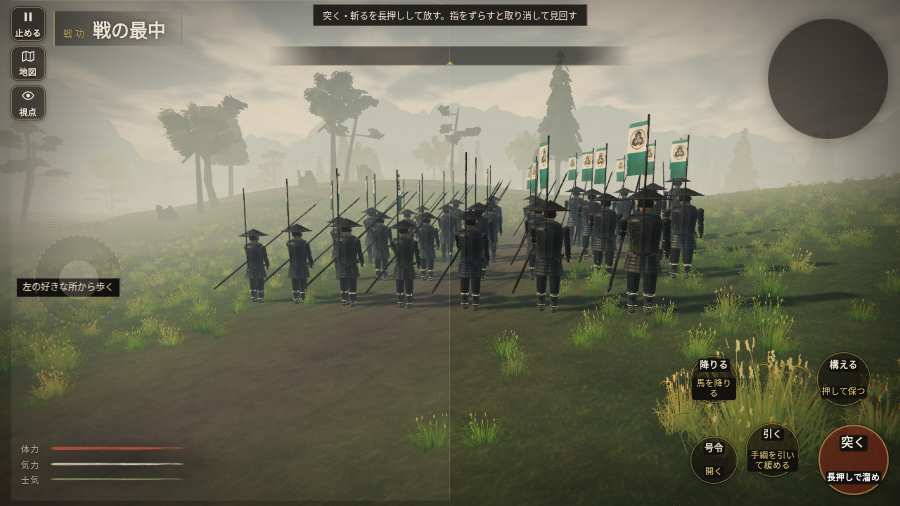

# テストプレイヤーの感想：指揮好きの戦略家

- 人：ケイコ（45歳・将棋と戦略ゲーム好き）（9188番）
- 変わり目：走りっぱなし・パソコン 1280×720・新しく始める通し・ふつう・身分 少し上・問屋:馬・一人称・感度 ふつう・途中で止める
- 時：2026/10/9 2:41:08（81秒かかった）
- 画面：パソコン 1280×720・鍵盤とマウス・画質 高
- 遊んだ戦：刀根坂の戦い（失敗・倒れた）
- 機械の混み具合：3（load average）

## ひとこと

> 刀根坂で、号令を19回かけました。号令「陣形」が、指の号令の輪から出せない。ここが直れば、ぐっと指揮が楽しくなる。城下から出陣できなかった。采配の上で、これは痛い。号令「突撃」から3秒たっても、組の7割が動かない。指揮官としてはもどかしい。采配で負けたのか、操作で負けたのか分からないのが一番困ります。問屋で駄馬8貫を揃えました。

## 見つけた問題（11件・困った順）

### 1. 号令「陣形」が、指の号令の輪から出せない
- どこで：刀根坂の戦い・1秒・brief
- 何が：号令の輪（RADIAL）に無い、または身分が足りず選べない（刀根坂の戦い・1秒・brief）
- どれくらい困ったか：★★★ やめたくなった（1回）
- 直し方の目安：号令の輪に足すか、短く押した時の指揮の札（数字の号令）を指で押せるようにする
- 画面：（その戦の山場の一枚）

### 2. 城下から出陣できなかった
- どこで：小谷城の戦いの前・城下
- 何が：「出陣」の釦が見つからない・押しても戦の前の札が出ない
- どれくらい困ったか：★★★ やめたくなった（1回）
- 画面：（その戦の山場の一枚）

### 3. HUD の札どうしが重なって読めない
- どこで：刀根坂の戦い・90秒・chase
- 何が：#brinkfx と .plaque（1280×720）／#brinkfx と .bl（1280×720）
- どれくらい困ったか：★★ かなり困った（9回）
- 直し方の目安：置き場所をずらすか、片方を出している間はもう片方を隠す
- 画面：（その戦の山場の一枚）

### 4. 号令「突撃」から3秒たっても、組の7割が動かない
- どこで：刀根坂の戦い・83秒・chase
- 何が：19人のうち動いたのは0人（刀根坂の戦い・83秒・chase）
- どれくらい困ったか：★★ かなり困った（2回）
- 直し方の目安：号令を受けた兵がすぐ向きを変えて動き出すようにする（行き先・狙いの付け直し）
- 画面：（その戦の山場の一枚）

### 5. 「親指の棒（歩く）」を押そうとしたら、別の物に当たった
- どこで：刀根坂の戦い・5秒・chase
- 何が：指の下にあったのは #battle-notices > #battle-message > #subtitle「組頭信長公の先駆けじゃ。朝倉」
- どれくらい困ったか：★★ かなり困った（1回）
- 直し方の目安：重ねている札の置き場所をずらすか、pointer-events:none にする
- 画面：

### 6. 前へ進もうとしても進めない所があった
- どこで：刀根坂の戦い・34秒・chase
- 何が：(2, 47)・段 chase
- どれくらい困ったか：★★ かなり困った（1回）
- 直し方の目安：当たり（柵・建物・地形）と道のつながりを見直す
- 画面：

### 7. 同じ知らせが20秒に4回以上
- どこで：刀根坂の戦い・44秒・chase
- 何が：「者ども、ついて来い！」（台詞）
- どれくらい困ったか：★ 少し気になった（4回）
- 直し方の目安：一度出したら、しばらく同じ物を出さない
- 画面：（その戦の山場の一枚）

### 8. 押せる所が小さい（28px 未満）
- どこで：刀根坂の戦い・戦のあと
- 何が：.ek-in > .note > .word-help：26×44「足軽」／.ek-in > .note > .word-help：26×44「戦功」
- どれくらい困ったか：★ 少し気になった（4回）
- 直し方の目安：押せる大きさを 28px 以上に
- 画面：（その戦の山場の一枚）

### 9. 倒れて戦が終わった
- どこで：刀根坂の戦い・109秒・chase
- 何が：93秒で倒れた（受けた傷：足軽 101・侍 0）
- どれくらい困ったか：★ 少し気になった（1回）
- 直し方の目安：初めの戦は受ける傷を減らす・危ない時に字幕で構えを教える
- 画面：（その戦の山場の一枚）

### 10. 戦場が札に食われている（画面の3分の1超）
- どこで：刀根坂の戦い・90秒・chase
- 何が：1280×720 で 100%
- どれくらい困ったか：★ 少し気になった（1回）
- 直し方の目安：札を小さくするか、平時は薄く・畳む
- 画面：（その戦の山場の一枚）

### 11. 押せる所どうしが重なっている
- どこで：刀根坂の戦い・戦のあと
- 何が：「足軽」と「戦功」
- どれくらい困ったか：★ 少し気になった（1回）
- 直し方の目安：間を空ける
- 画面：（その戦の山場の一枚）

## 遊んだ記録

- 刀根坂の戦い：93秒・任務失敗（倒れた）・戦功0・組19/20・討ち取り0・突き0/当たり0・号令19回・指で押した数42・読み込み7.0秒・戦の前の札170字・1コマ12.9ms（実時間47秒・内訳 brain 0.1・pad 0.1・tf 0.2・upd 12.4・eye 0.1）
  - 任務の流れ：0s 組を率い、馬廻を支えよ → 5s 馬廻と共に、街道の殿を崩せ
  - 味方の隊：隊15・動いた計1078m・味方の討ち取り4・敵を前に20秒止まった7回・本物の味方5人未満0秒
  - 受けた傷：足軽 101・侍 0
  - 開戦：
