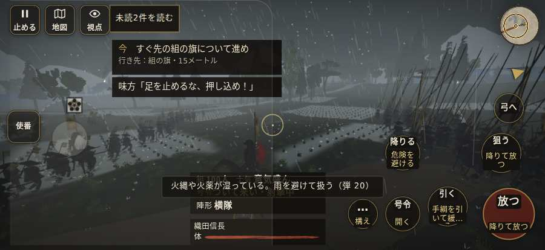

# テストプレイヤーの感想：アクション好き

- 人：ソウタ（24歳・アクションゲーム好き）（9292番）
- 変わり目：走りっぱなし・iPhone 横 874×402・信長で出陣・速い・身分 上・問屋:刀・槍・具足・三人称・感度 ふつう・途中で止める
- 時：2026/10/9 2:20:51（245秒かかった）
- 画面：iPhone の横向き 874×402・倍率3・指で触る操作（touch.js の釦・棒・なぞり）・画質 低
- 遊んだ戦：桶狭間の戦い（信長で出陣）（試験の持ち時間で打ち切り）（失敗）
- 機械の混み具合：3（load average）

## ひとこと

> とにかく突っ込んだ。4分で0人斬った。前へ進もうとしても進めない所があった、もったいない。「親指の棒（歩く）」を押そうとしたら、別の物に当たった、ここは爽快感が死んでる。斬り合う相手が少なくて退屈、もったいない。もっと派手に、じゃなくて重く斬り合いたい。

## 見つけた問題（5件・困った順）

### 1. 前へ進もうとしても進めない所があった
- どこで：桶狭間の戦い（信長で出陣）・34秒・march
- 何が：(30, -10)・段 march
- どれくらい困ったか：★★ かなり困った（5回）
- 直し方の目安：当たり（柵・建物・地形）と道のつながりを見直す
- 画面：

### 2. 「親指の棒（歩く）」を押そうとしたら、別の物に当たった
- どこで：桶狭間の戦い（信長で出陣）・0秒・brief
- 何が：指の下にあったのは #battle-message > #subtitle > span「首は取るな、討ち捨てにせよ。」
- どれくらい困ったか：★★ かなり困った（1回）
- 直し方の目安：重ねている札の置き場所をずらすか、pointer-events:none にする
- 画面：

### 3. 行き先があるのに20秒動かない兵
- どこで：桶狭間の戦い（信長で出陣）・150秒・assault
- 何が：味方の足軽：味方の足軽（号令：attack・織田の槍組・頭：無/―・近い敵4m）at (87,28)／味方の侍：味方の侍（号令：attack・織田信長の本陣・頭：無/―・近い敵2m）at (87,33)
- どれくらい困ったか：★ 少し気になった（2回）
- 直し方の目安：道が塞がれていないか、行き先に着いたと見なせているかを見る
- 画面：（その戦の山場の一枚）

### 4. 斬り合う相手が少なくて退屈
- どこで：桶狭間の戦い（信長で出陣）・216秒・assault
- 何が：4分で0人
- どれくらい困ったか：★ 少し気になった（1回）
- 画面：（その戦の山場の一枚）

### 5. 自分のすぐそばの敵が6秒以上なにもしない
- どこで：桶狭間の戦い（信長で出陣）・187秒・assault
- 何が：敵の足軽：敵の足軽
- どれくらい困ったか：★ 少し気になった（1回）
- 直し方の目安：近くの敵（遊び手）を狙いに入れる
- 画面：（その戦の山場の一枚）

## 遊んだ記録

- 桶狭間の戦い（信長で出陣）（試験の持ち時間で打ち切り）（戦の任務とは別に、試験全体の持ち時間が尽きた）：216秒・任務失敗・戦功0・組100/100・討ち取り0・突き0/当たり0・号令0回・指で押した数3・読み込み3.0秒・戦の前の札121字・1コマ38.6ms（実時間197秒・内訳 brain 0.3・pad 0.1・tf 0.5・upd 37.5・eye 0.2）
  - 任務の流れ：0s 今川の備えへかかれ → 7s 今川の備えへかかれ／すぐ先の組の旗について進め → 42s 今川の備えへかかれ／雨が弱まるまで組のそばで構え、かかれの合図を待て → 59s 味方の旗に続き、道の守りを崩せ → 130s 組とともに、義元を囲む旗本を崩せ
  - 味方の隊：隊6・動いた計1015m・味方の討ち取り23・敵を前に20秒止まった9回・本物の味方5人未満0秒
  - 開戦：
